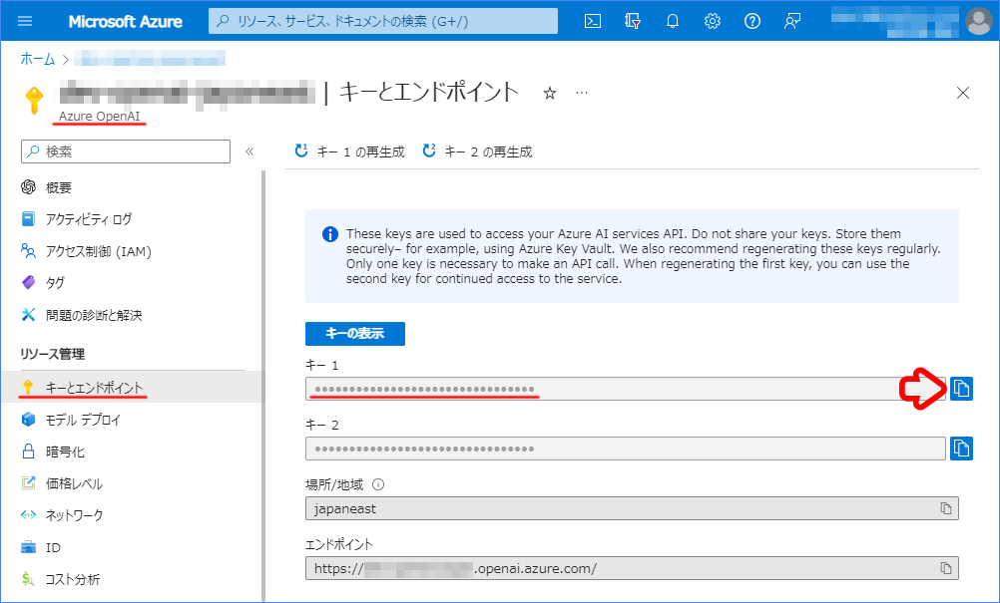
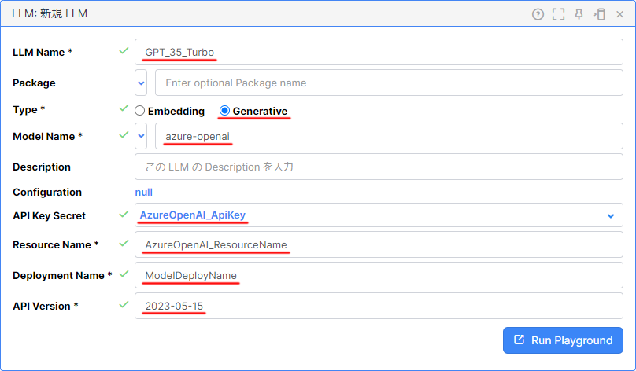
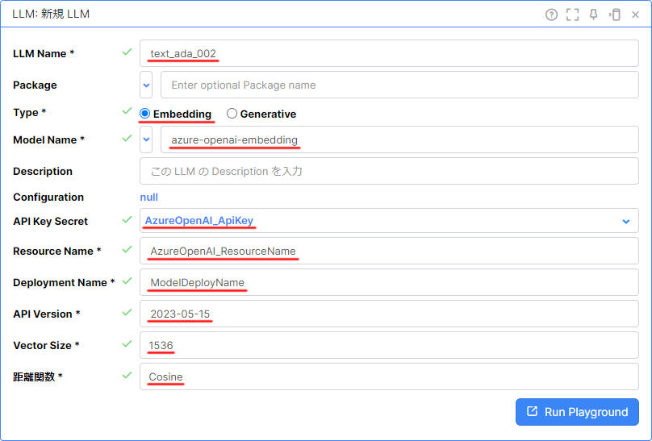

# Azure OpenAI のモデルを Vantiq で利用する方法

LLM リソースでは、既定のモデル（OpenAI や HuggingFace）以外も利用できます。  
今回は Azure OpenAI でデプロイしたモデルを Vantiq で利用する方法を解説します。  

> [!TIP]
> LLM リソースを初めて扱う場合は、下記のトレーニングセッションを実施いただくとを推奨しています。  
>
> - [LLM（SubmitPrompt Activity）](/vantiq-introduction/apps-development/llm/submitprompt-activity/readme.md)

## 目次

- [Azure OpenAI のモデルを Vantiq で利用する方法](#azure-openai-のモデルを-vantiq-で利用する方法)
  - [目次](#目次)
  - [前提条件](#前提条件)
  - [Azure OpenAI の API Key の設定](#azure-openai-の-api-key-の設定)
  - [Generative LLM の設定方法](#generative-llm-の設定方法)
  - [Embedding LLM の設定方法](#embedding-llm-の設定方法)

## 前提条件

- Azure Open AI Service のリソースが作成されていること。
- Azure Open AI Service のリソースに、使用したいモデルがデプロイされていること。

> [!NOTE]
> この文書ではAzure OpenAI Service のリソース作成方法やデプロイ方法については解説しません。  
> :globe_with_meridians: [公式のリファレンス](https://learn.microsoft.com/ja-JP/azure/ai-services/openai/overview) や以下のようなインターネット上の記事を参照して設定してください。  
> - :globe_with_meridians: [Azure OpenAI ServiceをRESTで使う](https://qiita.com/vfuji/items/196c8bb31be0ebdc8886)
> - :globe_with_meridians: [Azure OpenAI Serviceの世界へようこそ](https://note.com/fushiroyama/n/n584473dd57b2)

## Azure OpenAI の API Key の設定

Azure OpenAI の API Key を Secret として保存します。  
OpenAI の API Key と同様に設定していきます。  

1. Azure Portal から Azure OpenAI を開きます。

1. `キーとエンドポイント` を開き、 `キー　1` をコピーします。

   

1. Vantiq IDE を開き、メニューバーの `管理` -> `Advanced` -> `Secrets` -> `+ 新規` をクリックし Secret の新規作成画面を開きます。

1. コピーした Azure OpenAI の API キーを Secret として保存します。

## Generative LLM の設定方法

OpenAI の LLM と同様に設定していきます。

<details>
<summary>Vantiq r1.39 以降</summary>

1. Azure Portal から Azure OpenAI を開きます。

1. `リソース名` をコピーします。

   

1. `モデル デプロイ` を開き、 `展開の管理` をクリックします。

   

1. 任意の `Generative LLM` の `デプロイ名` をコピーします。

   

   > **補足**  
   > デプロイ済みのモデルが存在しない場合は、 `+ 新しいデプロイの作成` からモデルをデプロイしてください。

1. Vantiq IDE を開き、メニューバーの `追加` -> `LLMs` -> `+ 新規` をクリックし LLM の追加画面を開きます。

1. 以下の内容を設定し、 `OK` をクリックします。

   |項目|設定値|
   |-|-|
   |LLM Name|※任意の名前|
   |Type|Generative|
   |Model Name|azure-openai|
   |Configuration|null|
   |API Key Secret|※Azure OpenAI の Secret|
   |Resource Name|※Azure OpenAI のリソース名|
   |Deployment Name|※Azure OpenAI のデプロイ名|
   |API Version|※Azure OpenAI の API バージョン（[詳細](https://learn.microsoft.com/en-us/azure/ai-services/openai/reference#chat-completions)）|

   

> **補足：Configuration について**  
> Configuration が `null` 以外になっていると正しく動作しないので注意してください。  

</details>

<details>
<summary>Vantiq r1.37.6 ～ r1.38</summary>

1. Azure Portal から Azure OpenAI を開きます。

1. `キーとエンドポイント` を開き、 `エンドポイント` をコピーします。

   

1. `モデル デプロイ` を開き、 `展開の管理` をクリックします。

   

1. 任意の `Generative LLM` の `デプロイ名` をコピーします。

   

   > **補足**  
   > デプロイ済みのモデルが存在しない場合は、 `+ 新しいデプロイの作成` からモデルをデプロイしてください。

1. Vantiq IDE を開き、メニューバーの `追加` -> `LLMs` -> `+ 新規` をクリックし LLM の追加画面を開きます。

1. 以下の内容を設定し、 `OK` をクリックします。

   |項目|設定値|
   |-|-|
   |LLM Name|※任意の名前|
   |Type|Generative|
   |Model Name|※任意のモデル|
   |config|※下記参照|
   |API Key Secret|※Azure OpenAI の Secret|

   **config の設定値**

   ```json
   {
       "class_name": "langchain.chat_models.AzureChatOpenAI"
       , "azure_deployment": "【Azure OpenAI のデプロイ名】"
       , "azure_endpoint": "【Azure OpenAI のエンドポイント】"
       , "openai_api_version": "2023-05-15"
   }
   ```

   

</details>

<details>
<summary>Vantiq r1.37.5 以前</summary>

1. Azure Portal から Azure OpenAI を開きます。

1. `キーとエンドポイント` を開き、 `エンドポイント` をコピーします。

   

1. `モデル デプロイ` を開き、 `展開の管理` をクリックします。

   

1. 任意の `Generative LLM` の `デプロイ名` をコピーします。

   

   > **補足**  
   > デプロイ済みのモデルが存在しない場合は、 `+ 新しいデプロイの作成` からモデルをデプロイしてください。

1. Vantiq IDE を開き、メニューバーの `追加` -> `LLMs` -> `+ 新規` をクリックし LLM の追加画面を開きます。

1. 以下の内容を設定し、 `OK` をクリックします。

   |項目|設定値|
   |-|-|
   |LLM Name|※任意の名前|
   |Type|Generative|
   |Model Name|※任意のモデル|
   |config|※下記参照|
   |API Key Secret|※Azure OpenAI の Secret|

   **config の設定値**

   ```json
   {
       "class_name": "langchain.chat_models.azure_openai.AzureChatOpenAI"
       , "deployment_name": "【Azure OpenAI のデプロイ名】"
       , "openai_api_base": "【Azure OpenAI のエンドポイント】"
       , "openai_api_version": "2023-05-15"
   }
   ```

   

</details>

## Embedding LLM の設定方法

OpenAI の LLM と同様に設定していきます。

<details>
<summary>Vantiq r1.39 以降</summary>

1. Azure Portal から Azure OpenAI を開きます。

1. `リソース名` をコピーします。

   

1. `モデル デプロイ` を開き、 `展開の管理` をクリックします。

   

1. 任意の `Embedding LLM` の `デプロイ名` をコピーします。

   

   > **補足**  
   > デプロイ済みのモデルが存在しない場合は、 `+ 新しいデプロイの作成` からモデルをデプロイしてください。

1. Vantiq IDE を開き、メニューバーの `追加` -> `LLMs` -> `+ 新規` をクリックし LLM の追加画面を開きます。

1. 以下の内容を設定し、 `OK` をクリックします。

   |項目|設定値|
   |-|-|
   |LLM Name|※任意の名前|
   |Type|Embedding|
   |Model Name|azure-openai-embedding|
   |Configuration|null|
   |API Key Secret|※Azure OpenAI の Secret|
   |Resource Name|※Azure OpenAI のリソース名|
   |Deployment Name|※Azure OpenAI のデプロイ名|
   |API Version|※Azure OpenAI の API バージョン（:globe_with_meridians: [詳細](https://learn.microsoft.com/en-us/azure/ai-services/openai/reference#embeddings)）|
   |Vector Size|text-embedding-ada-002：1536<br>text-embedding-3-large：3072|
   |距離関数|Cosine|

   

> **補足：Configuration について**  
> Configuration が `null` 以外になっていると正しく動作しないので注意してください。  

> **補足：距離関数について**  
> 距離関数は下記から選択可能ですが、 `Cosine` が推奨されています。  
> :globe_with_meridians: [Embeddings - OpenAI API](https://platform.openai.com/docs/guides/embeddings/which-distance-function-should-i-use)  
> 
> - Dot product: `Dot`
> - Cosine similarity: `Cosine`
> - Euclidean distance: `Euclid`
> - Manhattan distance: `Manhattan`
> 
>:globe_with_meridians: [Collections - Qdrant](https://qdrant.tech/documentation/concepts/collections/)  

</details>

<details>
<summary>Vantiq r1.37.6 ～ r1.38</summary>

1. Azure Portal から Azure OpenAI を開きます。

1. `キーとエンドポイント` を開き、 `エンドポイント` をコピーします。

   

1. `モデル デプロイ` を開き、 `展開の管理` をクリックします。

   

1. 任意の `Embedding LLM` の `デプロイ名` をコピーします。

   

   > **補足**  
   > デプロイ済みのモデルが存在しない場合は、 `+ 新しいデプロイの作成` からモデルをデプロイしてください。

1. Vantiq IDE を開き、メニューバーの `追加` -> `LLMs` -> `+ 新規` をクリックし LLM の追加画面を開きます。

1. 以下の内容を設定し、 `OK` をクリックします。

   |項目|設定値|
   |-|-|
   |LLM Name|※任意の名前|
   |Type|Embedding|
   |Model Name|※任意のモデル|
   |config|※下記参照|
   |API Key Secret|※Azure OpenAI の Secret|

   **config の設定値**

   ```json
   {
       "class_name": "langchain.embeddings.AzureOpenAIEmbeddings"
       , "azure_deployment": "【Azure OpenAI のデプロイ名】"
       , "azure_endpoint": "【Azure OpenAI のエンドポイント】"
       , "openai_api_version": "2023-05-15"
   }
   ```

   

</details>

<details>
<summary>Vantiq r1.37.5 以前</summary>

1. Azure Portal から Azure OpenAI を開きます。

1. `キーとエンドポイント` を開き、 `エンドポイント` をコピーします。

   

1. `モデル デプロイ` を開き、 `展開の管理` をクリックします。

   

1. 任意の `Embedding LLM` の `デプロイ名` をコピーします。

   

   > **補足**  
   > デプロイ済みのモデルが存在しない場合は、 `+ 新しいデプロイの作成` からモデルをデプロイしてください。

1. Vantiq IDE を開き、メニューバーの `追加` -> `LLMs` -> `+ 新規` をクリックし LLM の追加画面を開きます。

1. 以下の内容を設定し、 `OK` をクリックします。

   |項目|設定値|
   |-|-|
   |LLM Name|※任意の名前|
   |Type|Embedding|
   |Model Name|※任意のモデル|
   |config|※下記参照|
   |API Key Secret|※Azure OpenAI の Secret|

   **config の設定値**

   ```json
   {
       "class_name": "langchain.embeddings.OpenAIEmbeddings"
       , "deployment": "【Azure OpenAI のデプロイ名】"
       , "openai_api_base": "【Azure OpenAI のエンドポイント】"
       , "openai_api_version": "2023-05-15"
       , "openai_api_type": "azure"
   }
   ```

   

</details>
