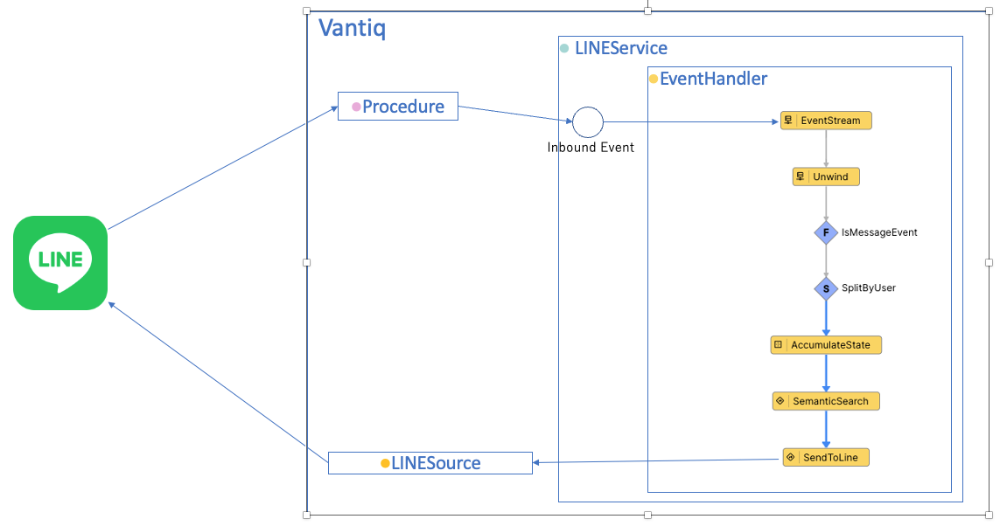
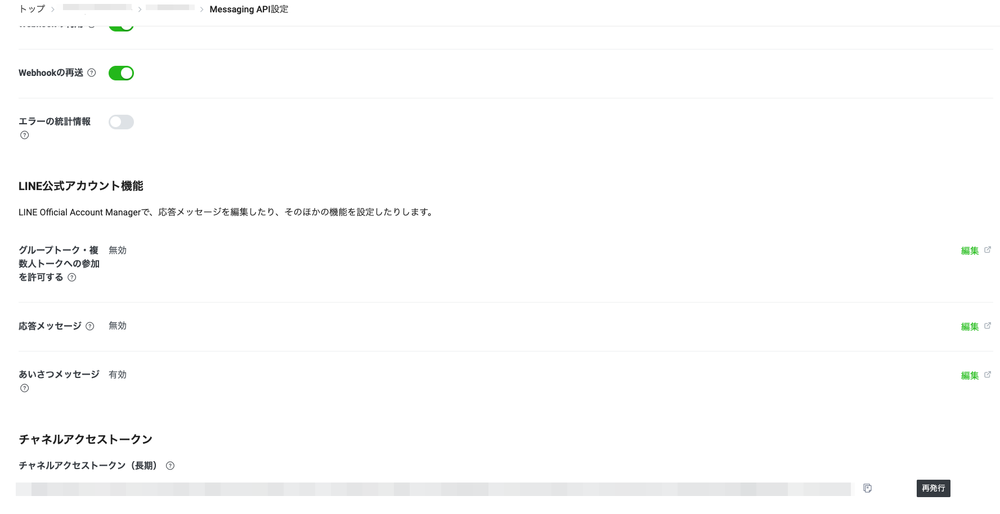
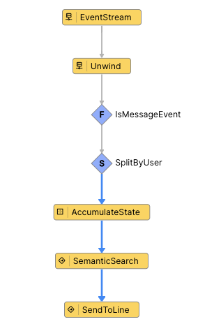
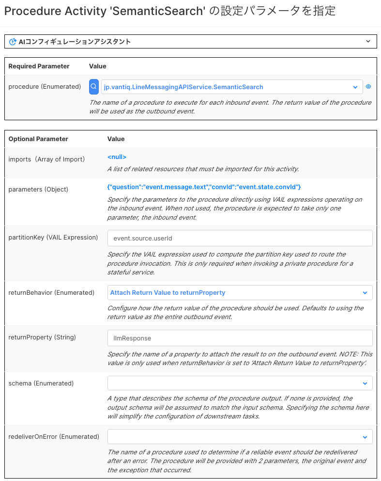
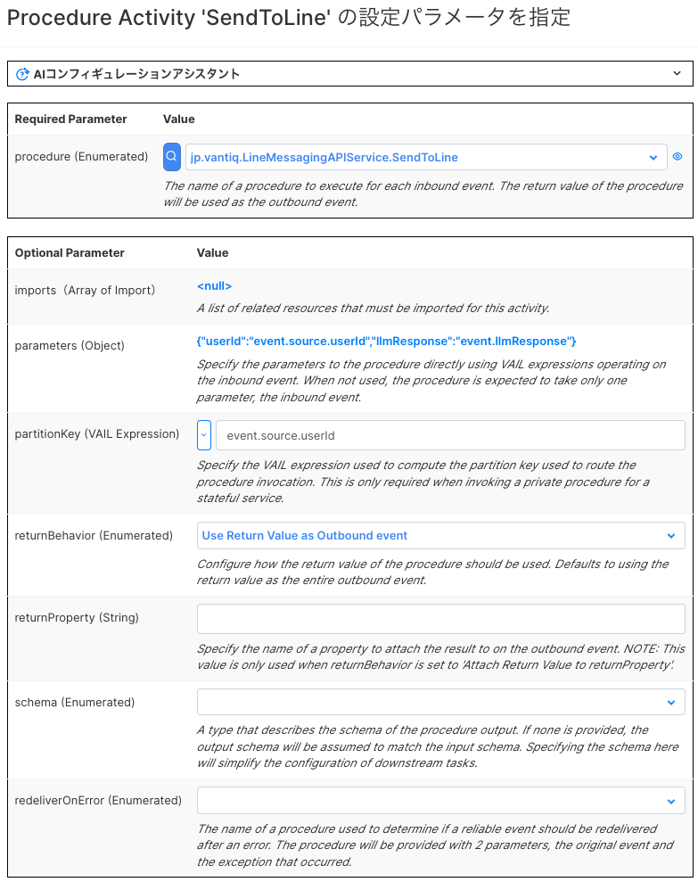

# Vantiq LLM とLINEのインテグレーションサンプル

## 概要

Vantiq LLMの機能と、LINE botを使用して、LINEとの連携を実現するサンプルです。社内の独自情報をSemantic Indexに登録し、LINEからSemantic Indexに登録した情報を問い合わせることができます。

全体構成は以下の通りです。


## 前提

- LINE公式アカウントやMessaging API の作成方法・設定方法については解説しません。[公式ドキュメント](https://developers.line.biz/ja/docs/) などを参考に作成・設定してください
- LLMs,Semantic Index のリソースは含まれません。各自OpenAIなどの必要なAPI Keyを取得し、リソースの作成やSemantic Index Entryの追加などを行ってください
- LINE Messaging API Webhook -> Vantiq の疎通が可能であること
- Vantiq -> LINE API の疎通が可能であること

## 手順

以下の手順で解説する各Vantiqリソース名はサンプルです。任意に命名してください。

### Vantiq Source の作成

VantiqからLINEにメッセージを送信するためのRemoteSourceを作成します。

1. LINE Messaging API のチャンネルアクセストークンを取得します。チャンネルアクセストークンは、LINE Developers コンソール のMessaging API の設定画面から取得できます。


1. RemoteSource `jp.vantiq.LineAPI`を作成し、LINE API のURL `https://api.line.me`を設定します。Authorization Property は、`Credential Type` を Access Token に設定し、`Access Token` に上記で取得したチャンネルアクセストークンを設定します。


### Vantiq Service の作成

LINEからのEventを受信し、Semantic Indexに登録された情報を返すVantiq Serviceを作成します。

1. Service `jp.vantiq.LineMessagingAPIService` を作成します。

2. Service のInbound Event に、LINE Webhookイベントを受信するための `webhook` を追加します。

3. `webhook` のEvent Handlerを実装します。以下のように実装します。


   - Unwind : `webhook` で受信したEventを展開します。(1つのWebhookに複数のWebhookイベントオブジェクトが含まれる場合があるため) EventStreamに直接Eventの配列が流れてくるため、unwindPropertyの設定は不要です。
   - IsMessageEvent : `Filter` アクティビティです。`webhook` で受信したEventがMessageEventかどうかを判定します。今回はメッセージイベントのみを対象とします。conditions に `event.type == "message"` を設定します。
   - SplitByUser : 受信したEventのUserIdをキーにして、ユーザー毎に会話を管理します。groupByに `event.source.userId` を設定します。
   - AccumulateState : 会話IDの生成・保持を行います。
     - 以下のように設定します。
      
     - vailの記述内容は以下の通りです。Vantiqの会話コンテクスト管理に関しての詳細は、[リファレンス](https://dev.vantiq.com/docs/system/rules/index.html#conversationmemory) を参照してください。

         ```javascript
         // Update the value of state using event.
         if !state {
            state = {}
         }
         if !state.convId {
            // convIdが存在しない場合、ConversationMemoryに会話を開始するようにリクエストする
            var startConv = []
            state.convId = io.vantiq.ai.ConversationMemory.startConversation(startConv)
         } 
         ```

   - SemanticSearch : `Procedure` アクティビティです。Semantic Indexに登録された情報を検索し、結果を返します。
     - 以下のService Procedureを作成してください。

         ```javascript
         package jp.vantiq
         import service io.vantiq.ai.SemanticSearch
         import service io.vantiq.text.Template
         import service io.vantiq.ai.ConversationMemory
         PROCEDURE LineMessagingAPIService.SemanticSearch(question String REQUIRED, convId String): Object

         var INDEX_NAME = <Semantic Index Name>
         var GENERATIVE_AI = <Generative LLM Name>
         var ERROR_TEXT = "エラーが発生しました。"
         var TEMPLATE = "以下の質問に日本語で回答してください。質問です。「${question}」"

         var input = {
            "question": question
         }
         var prompt = Template.format(TEMPLATE, input)

         var result
         try {
            result = SemanticSearch.answerQuestion(INDEX_NAME, prompt, GENERATIVE_AI, convId)
         if convId {
            var covMem = ConversationMemory.getConversation(convId)
            log.info(stringify(covMem))
         }
         }catch(error) {
            result = {"answer": ERROR_TEXT}
            log.info(stringify(error))
         }

         return result
         ```

     - アクティビティの設定は以下の通りです。
       

   - SendToLine : `Procedure` アクティビティです。RemoteSourceにメッセージを送信します。
     - 以下のService Procedureを作成してください。

         ```javascript
         package jp.vantiq
         ROCEDURE LineMessagingAPIService.SendToLine(userId String, llmResponse Object )

         var source_config = {
            "path": "/v2/bot/message/push"
         }

         var data = {
            "to": userId,
            "messages": [
               {
                  "text": llmResponse.answer,
                  "type": "text"
               }
            ]
         }

         PUBLISH { "body": data } TO SOURCE jp.vantiq.LineAPI Using source_config

         return null
         ```

     - アクティビティの設定は以下の通りです。
       

### LINE Webhook Event の受信

1. LINE Webhook Eventを受信する Procedure を作成します。通常、VantiqでRESTでEventを受信する場合はTopicを使用しますが、TopicはEventを受信して`HTTP 200 OK` を返すだけなので[リクエストの検証処理](https://developers.line.biz/ja/docs/messaging-api/receiving-messages/#verifying-signatures)を行うことができません。よってProcedureでイベントを受信し、Procedure内で署名検証を行う必要があります。
Procedureのサンプルは以下となります。検証に成功した場合、ServiceのInbound EventにPublishします。
まず、チャンネルシークレット・リクエストボディ・x-line-signature を受け取り、署名検証を行うService Procedureを作成します。(チャンネルシークレットは、LINE Developers コンソール のMessaging API の設定画面から取得できます。)

```javascript
package jp.vantiq
PROCEDURE LineMessagingAPIService.validateLineRequest(channelSecret String, requestBody String, lineSignature String)
// see https://developers.line.biz/ja/reference/messaging-api/#signature-validation
var digest = Hash.hmacSha256(channelSecret, requestBody)
var encodedDigest = Encode.base64(digest)

return encodedDigest == lineSignature
```

次に、LINE Webhook Eventを受信するProcedureを作成します。以下のように実装します。

```javascript
PROCEDURE ReceiveLineMessages(destination String, events Object ARRAY)
var headers = Utils.getHttpHeaders()

var channelSecret = <Channel Secret>
var requestBody = {destination: destination, events : events}
var lineSignature = headers."x-line-signature"

if jp.vantiq.LineMessagingAPIService.validateLineRequest(channelSecret, stringify(requestBody), lineSignature) {
   // 署名検証に成功したらServiceにPublish
   PUBLISH events TO SERVICE EVENT "jp.vantiq.LineMessagingAPIService/webhook"
}
```

1. LINE Messaging API のWebhook Url に、上記で作成したProcedureのURLを設定します。URLには、VantiqのREST APIのURLを設定します。クエリパラメータでVantiqのAPI Tokenを渡します。

 > **NOTE**
 > 通常、POSTリクエストではクエリパラメータを使用しませんが、VantiqのREST APIは認証が必要なため、クエリパラメータでAPI Tokenを渡します。クエリパラメータに認証情報を含めることはセキュリティ上問題があるため、プロダクション環境ではAPI GatewayでAuthorization Headerを付与するなどの対応が必要です。

   ```javascript
   https://dev.vantiq.com/api/v1/resources/procedures/ReceiveLineMessages?token=<API Token>
   ```


## 実行

- LINEアプリでLINE Botを友達登録し、質問してください。Semantic Indexからの返信が行われます。会話コンテクストも維持されます。

## リソース

- [サンプルプロジェクト](../../conf/vantiq_llm_line_integration/line_integration.zip)
