# Vantiq LLM とTeamsのインテグレーションサンプル

## 概要

Vantiq LLMの機能と、Azure Bot、Teams アプリを使用して、Microsoft Teamsとの連携を実現するサンプルです。社内の独自情報をSemantic Indexに登録し、TeamsからSemantic Indexに登録した情報を問い合わせることができます。

全体構成は以下の通りです。
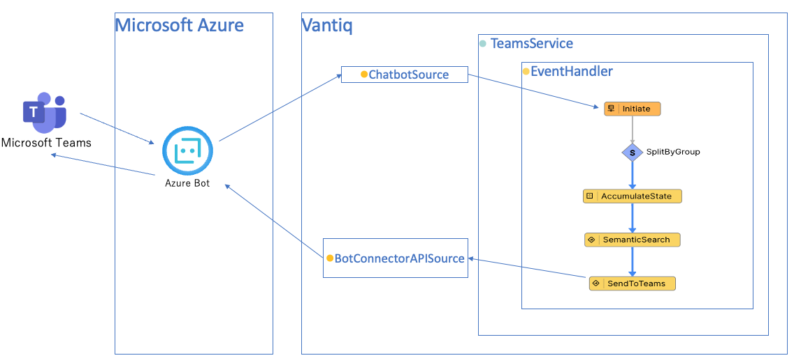

## 前提

- 有効なMicrosoft Azureアカウントを保有しており、Azure Bot のリソースが作成可能であること
- Azure Bot Service -> Vantiq の疎通が可能であること
- Vantiq -> Azure Bot Connector API の疎通が可能であること
- Microsoft Teams にカスタムアプリのインストールが可能であること。参考リンクは[こちら](https://learn.microsoft.com/en-us/microsoftteams/teams-custom-app-policies-and-settings)
- サンプルアプリにはLLMs,Semantic Index のリソースは含まれません。各自OpenAIなどの必要なAPI Keyを取得し、リソースの作成やSemantic Index Entryの追加などを行ってください

## 手順

以下の手順で解説する各Vantiqリソース名はサンプルです。任意に命名してください。

### Azure Bot リソース の作成

Azure Bot Service のリソースを作成します。

1. Azure Portal にログインし、検索バーで`Azure Bot`を検索します。Marketplace から `Azure Bot` を選択します。

   

1. Azure Bot を作成します。
   - ボットハンドル : 任意の名前を入力します。
   - サブスクリプション : 使用するサブスクリプションを選択します。
   - リソースグループ : 任意のリソースグループを選択します。
   - アプリの種類 : 今回は`シングルテナント`を選択します。
   - 作成の種類 : 今回は`新しい Microsoft アプリID の作成` を選択します。

   

1. 作成したBotのリソースに移動し、`チャンネル` から `Teams` を選択します。

   チャンネルの選択
   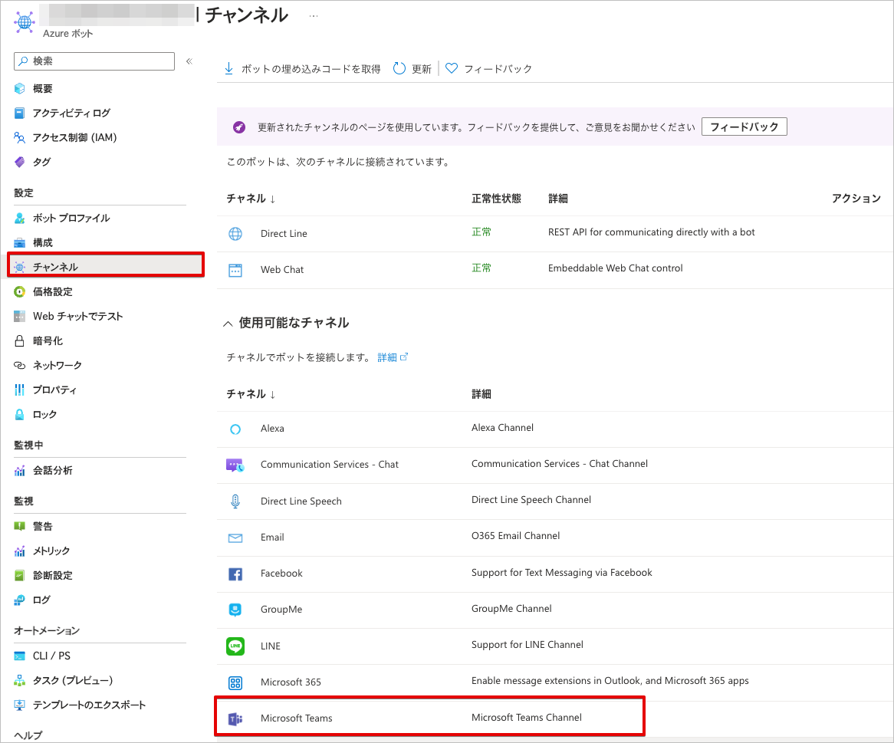

   追加後
   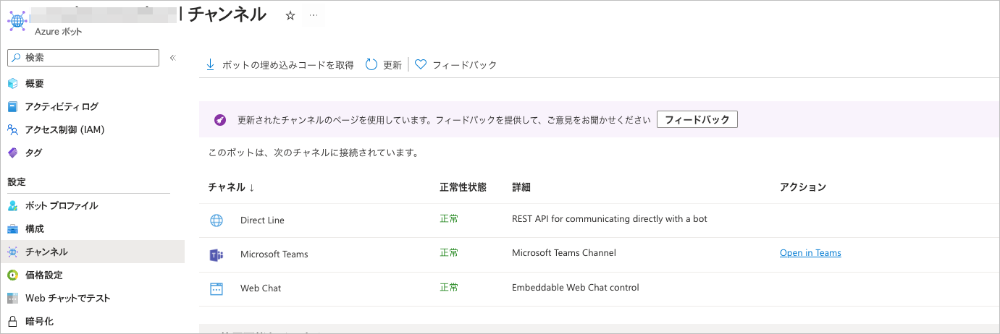

1. Botリソースの`構成` を選択し、Microsoft App ID の `パスワードの管理` を選択します。

   

1. `新しいクライアントシークレット` を選択し、クライアントシークレットを追加します。

   

1. 新しいクライアントシークレットが作成されます。作成直後しか確認できないため、必ずここでクライアントシークレットを保存してください。

   

### Vantiq Source の作成

以下3つの Source を作成します。

1. Azure Bot Service との連携用の ChatBot Source
2. Azure Bot Connector のOAuth Tokenを取得するための Remote Source
3. Azure Bot Connector 用の Remote Source

#### ChatBot Source の作成

1. Vantiq IDEで、[追加]->[Source]->[新規Source] を選択します。
1. `Source Name`、`Package`に任意の値を入力します。 `Source Type` に `ChatBot` を選択します。
1. Properties タブを表示し、以下の値を入力しSourceを保存します。
   - Microsoft App ID : Azure Bot の Microsoft App ID を入力します。
   - Microsoft App Secret : Azure Bot リソース の作成 で作成したクライアントシークレットを入力します。
   - Direct Line Secret Key : Azure Bot の Direct Line Secret Key を入力します。

   

1. Azure Portal で、Azure Bot のリソースに移動し、[構成]を選択します。メッセージエンドポイントに以下のURLを入力します。  
`<Vantiq Server>/private/chatbot/<namespaceName>/<sourceName>`

   

#### OAuth Source の作成

1. Vantiq IDEで、[追加]->[Source]->[新規Source] を選択します。
1. `Source Name`、`Package`に任意の値を入力します。 `Source Type` に `Remote` を選択します。
1. Properties タブを表示し、`Server URI` に以下の値を入力しSourceを保存します。  
   `https://login.microsoftonline.com/<アプリ テナント ID>/oauth2/v2.0/token`  
   アプリ テナント ID はAzure Portal で確認できます。

   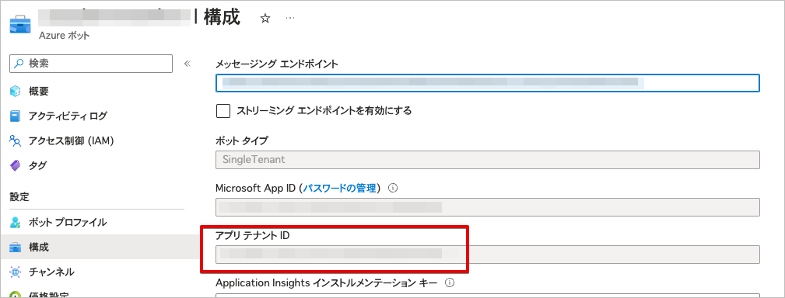

#### Azure Bot Connector  Source の作成

1. Vantiq IDEで、[追加]->[Source]->[新規Source] を選択します。
1. `Source Name`、`Package`に任意の値を入力します。 `Source Type` に `Remote` を選択します。
1. Properties タブを表示し、以下の値を入力しSourceを保存します。
   - Server URI : `https://smba.trafficmanager.net/amer`
   - OAuth Properties.Source Name : 作成したOAuth Source の名前を入力します。
   - OAuth Properties.Token Scope : `https://api.botframework.com/.default`
   - OAuth Properties.Grant Type : `client_credentials`
   - OAuth Properties.Client ID : Azure Bot の Microsoft App ID
   - OAuth Properties.Client Secret :  Azure Bot リソース の作成 で作成したクライアントシークレット

   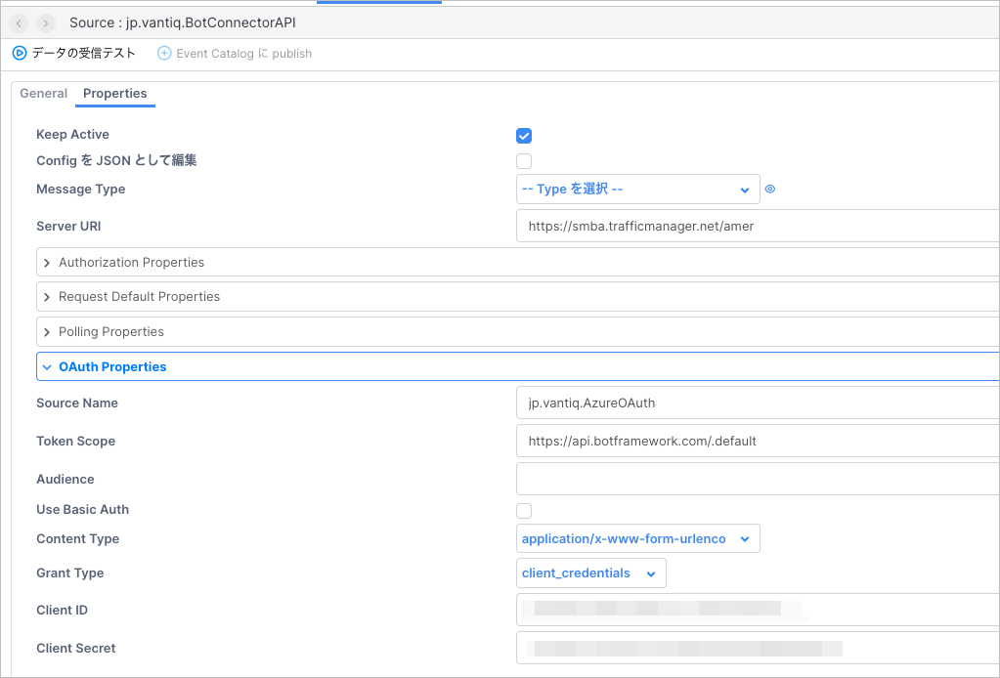

### Vantiq Service の作成

Teamsからのメッセージを受信し、Semantic Indexに登録された情報を返すVantiq Serviceを作成します。

1. Service `jp.vantiq.TeamsService` を作成します。

1. `Source Event Handler` を追加します。

   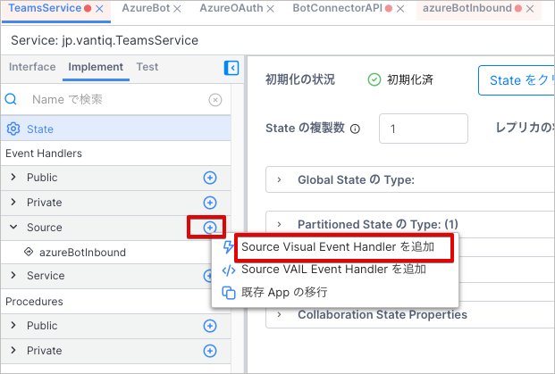

1. Source Event Handlerを実装します。以下のように実装します。

   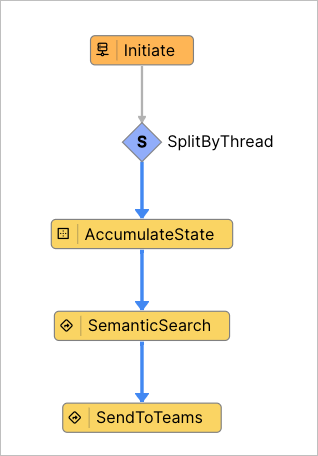

   - Initiate : 作成したChatBot Source をEventStream に設定します。
     - 以下のように設定します。

       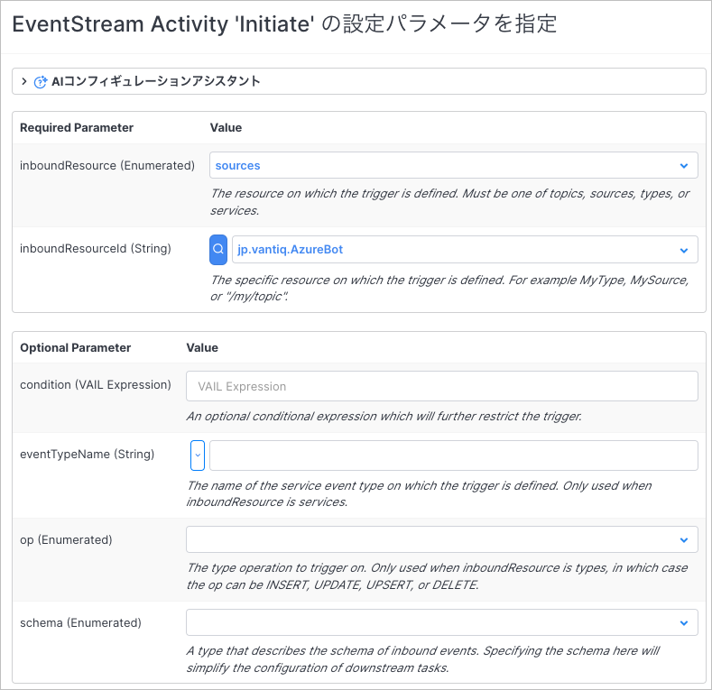

   - SplitByThread : 受信したEventの`conversation.id`をキーにして、スレッド毎に会話を管理します。

   - AccumulateState : 会話IDの生成・保持を行います。
     - 以下のように設定します。
  
       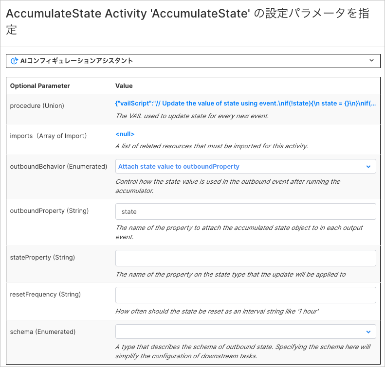

     - vailの記述内容は以下の通りです。Vantiqの会話コンテクスト管理に関しての詳細は、[リファレンス](https://dev.vantiq.com/docs/system/rules/index.html#conversationmemory) を参照してください。

       ```javascript
       // Update the value of state using event.
       if(!state){
       state = {}
       }
       if(!state.convId){
          // convIdが存在しない場合、ConversationMemoryに会話を開始するようにリクエストする
          var startConvo = []
          state.convId = io.vantiq.ai.ConversationMemory.startConversation(startConvo)
       } 
       ```

   - SemanticSearch : `Procedure` アクティビティです。Semantic Indexに登録された情報を検索し、結果を返します。
     - 以下のService Procedureを作成してください。

       ```javascript
       package jp.vantiq
       import service io.vantiq.ai.SemanticSearch
       import service io.vantiq.text.Template
       import service io.vantiq.ai.ConversationMemory
       stateless PROCEDURE TeamsService.SemanticSearch(question String REQUIRED, convId String): Object

       var INDEX_NAME = "Semantic Index Name"
       var GENERATIVE_AI = "GenerativeLLM Name"

       var ERROR_TEXT = "エラーが発生しました。"
       var TEMPLATE = "質問です。「${question}」"

       var input = {
          "question": question
       }

       var prompt = Template.format(TEMPLATE, input)
       var result
       try {
       result = SemanticSearch.answerQuestion(INDEX_NAME, prompt, GENERATIVE_AI, convId)
       if convId {
          var convMem = ConversationMemory.getConversation(convId)
          log.info(stringify(convMem))
       }
       }catch(error) {
          result = {"answer": ERROR_TEXT}
          log.error(stringify(error))
       }

       return result
       ```

     - アクティビティの設定は以下の通りです。

       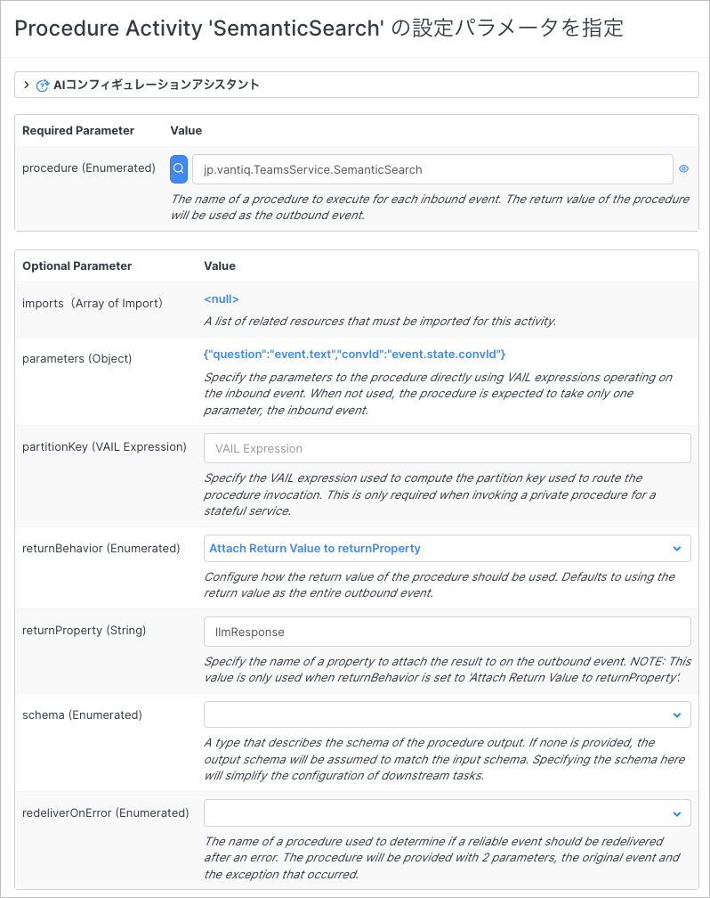

   - SendToTeams : `Procedure` アクティビティです。RemoteSourceにメッセージを送信します。
     - 以下のService Procedureを作成してください。

       ```javascript
       package jp.vantiq
       stateless PROCEDURE TeamsService.SendToTeams(llmResponse Object, from Object, conversation Object)

       var source_config = {
          "path": "/v3/conversations/" + conversation.id + "/activities"
       }

       // see https://learn.microsoft.com/ja-jp/azure/bot-service/rest-api/bot-framework-rest-connector-add-rich-cards?view=azure-bot-service-4.0
       var actions = []
       var firstTwoItems = llmResponse.metadata.slice(0, 2)
       for (item in firstTwoItems) {
          var action = {
                "type": "Action.OpenUrl",
                "url": item.url,
                "title": item.url
          }
          actions.push(action)
       }
       var references = [
          {
             "contentType": "application/vnd.microsoft.card.adaptive",
             "content": {
             "type": "AdaptiveCard",
             "version": "1.0",
             "body": [
                {
                   "type": "TextBlock",
                   "text": "参照リンク",
                   "size": "large"
                }
             ],
             "actions": actions
             }
          }
       ]

       var data = {
          "type": "message",
          "from": {
             "id": from.id,
             "name": from.name
          },
          "text": llmResponse.answer,
          "attachments": references
       }

       PUBLISH { "body": data } TO SOURCE <Azure Bot Connector Source> USING source_config
       return null
       ```

     - アクティビティの設定・パラメータの設定は以下の通りです。
  
       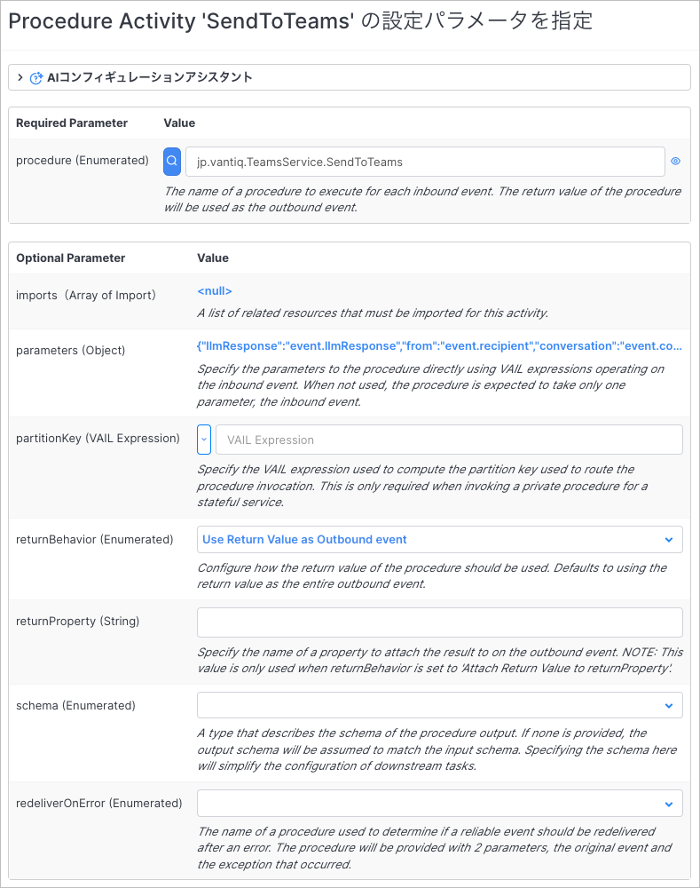

       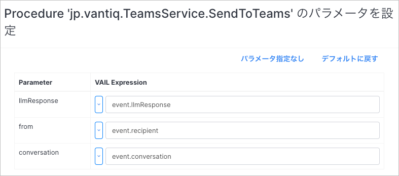

### Teams App のインストール

作成したBotを、Teamsの個別チャットではなくTeam で使用するためには、以下手順を踏む必要があります。

1. Microsoft Teams アプリのパッケージの作成
1. Microsoft Teams に作成したアプリをアップロード

#### Microsoft Teams アプリのパッケージの作成

- Teams アプリのパッケージを作成します。以下のリンクを参考にしてください。
  - [Teams アプリのパッケージの作成](https://learn.microsoft.com/en-us/microsoftteams/platform/concepts/build-and-test/apps-package)
- 以下のファイルが必要です。
  - アプリのマニフェスト
  - アプリのアイコン画像
- マニフェストのサンプルは [manifest.json](../../conf/vantiq_llm_teams_integration/manifest.json) です。マニフェストのスキーマは、[こちら](https://learn.microsoft.com/en-us/microsoftteams/platform/resources/schema/manifest-schema) です。

  ```json
  {
      "$schema": "https://developer.microsoft.com/json-schemas/teams/v1.16/  MicrosoftTeams.schema.json",
      "manifestVersion": "1.16",
      "version": "1.0.0",
      "id": "microsoft app id",
      "developer": {
          "name": "Author's name",
          "websiteUrl": "https://vantiq.co.jp/",
          "privacyUrl": "https://vantiq.co.jp/",
          "termsOfUseUrl": "https://vantiq.co.jp/"
      },
      "name": {
          "short": "short name of your app",
          "full": "full name of your app"
      },
      "description": {
          "short": "Short description of your app",
          "full": "Full description of your app"
      },
      "icons": {
          "outline": "outline.png",
          "color": "color.png"
      },
      "accentColor": "#000080",
      "bots": [
          {
              "botId": "microsoft app id",
              "scopes": [
                  "team",
                  "personal",
                  "groupChat"
              ],
              "needsChannelSelector": false,
              "isNotificationOnly": false,
              "supportsFiles": false,
              "supportsCalling": false,
              "supportsVideo": false
          }
      ],
      "permissions": [
          "identity",
          "messageTeamMembers"
      ],
      "devicePermissions": [
          "geolocation",
          "media",
          "notifications",
          "midi",
          "openExternal"
      ],
      "validDomains": [
          "internal.vantiq.com"
      ],
      "defaultInstallScope": "team",
      "defaultGroupCapability": {
          "team": "bot",
          "groupchat": "bot"
      }
  }
  ```

- マニフェストとアイコン画像を含めてzipファイルを作成します。  
  `zip pkg.zip manifest.json outline.png color.ping`

#### Microsoft Teams に作成したアプリをアップロード

- Teams へのアプリのアップロードは、以下のリンクを参考にしてください。[Teams アプリのアップロード](https://learn.microsoft.com/en-us/microsoftteams/platform/concepts/deploy-and-publish/apps-upload)
- 組織のポリシーによっては、アプリのアップロードが制限されている場合があります。その場合は、Teamsの管理者に連絡してください。[カスタム Teams アプリを有効にし、カスタム アプリのアップロードをオンにする](https://learn.microsoft.com/en-us/microsoftteams/platform/concepts/build-and-test/prepare-your-o365-tenant#enable-custom-teams-apps-and-turn-on-custom-app-uploading)
- Teams では、カスタムアプリのセットアップポリシーにより、ユーザー・チーム・組織全体におけるカスタムアプリのアップロード権限の制御が可能になっています。ここでは、チームにカスタムアプリをアップロードする手順を説明します。
  1. Teams アプリをインストールしたいチームを選択します。
  2. `チームを管理` を開きます。
  3. `アプリ` タブを選択します。
  4. `アプリをアップロード` を選択し、作成したzipファイルをアップロードします。
  5. アプリがアップロードされたら、チームのメンバーはアプリを利用できるようになります。

## 実行

- TeamsアプリをインストールしたTeamで、`@bot名` で質問してください。スレッドで返信が行われます。スレッド内では会話コンテクストが維持されます。

## リソース

- [サンプルプロジェクト](../../conf/vantiq_llm_teams_integration/llm_teams_integration.zip)
