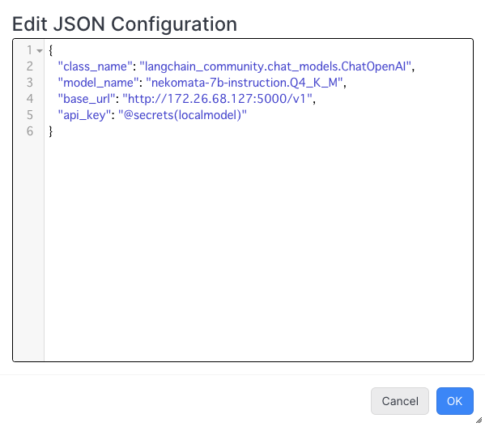

# LLM プライベートモデルの利用

プライベートで構成した LLM(Large Language Model) を Vantiq で利用する手順についての解説となります。

# 前提条件

- OpenAI API 互換の REST エンドポイントが提供されていること
- REST エンドポイントと Vantiq の間においてネットワークの疎通がとれていること
- Vantiq r1.38以降であること

## OpenAI API 互換の REST エンドポイント

OpenAI API 互換の REST エンドポイントを用意する方法はいくつかあります。試験環境としては[Qiita記事:自分専用の大規模言語モデルを動作させるAPIサーバを立ててみた](https://qiita.com/vfuji/items/67b95da35704ee440f4c)の手順でも簡単に構成可能です。本番環境で利用する場合は、適切な VRAM を有する GPU を持ったサーバを別途用意する方が望ましいと思います。

# 手順

## LLM リソースを作成

Vantiq IDE にて Add -> LLM -> New LLM から新しい LLM の Generative モデルを作成します。LLM Name は任意の名前を設定してください。Type は Generative を選択します。Model Name はプルダウンメニューから選択できるモデル'以外'であれば何でも構いません。

Configuration は次のような形で入力してください。api-key はローカルモデルへアクセスする際のapi keyとなります。base_url にはホスト名もしくはIPアドレスとポート番号を指定します。http で構成することが多いので、http なのか https なのか、よくご確認ください。

```
{
   "class_name": "langchain_community.chat_models.ChatOpenAI",
   "model_name": "nekomata-7b-instruction.Q4_K_M",
   "base_url": "http://{HOSTNAME or IP}:{PORT NUMBER}/v1",
   "api_key": "{YOUR API KEY}"
}
```

## 設定内容の確認

次のような設定となります。確認の上、Save ボタンを押下します。




# その後の手順

続きの設定については [LLM Platform Support](azure_openai_config.md/LLM_Platform_Support.md) を参照の上、進めてください。

# オプション: Source を使った設定

LLM 機能ではなく、Vantiq Source を使った設定を行う必要がある場合は、[こちらの記事](./vantiq_llm_use_local_models_via_source.md)をご参照ください。特別な理由がない限り LLM リソースとして利用することを推奨します。