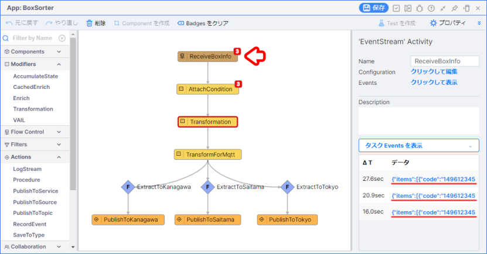
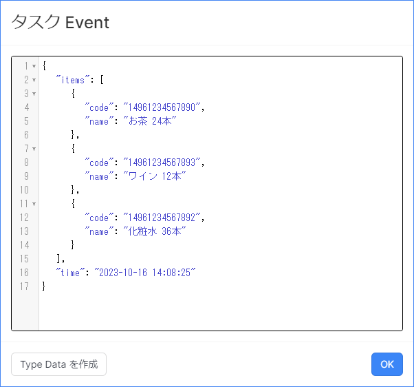
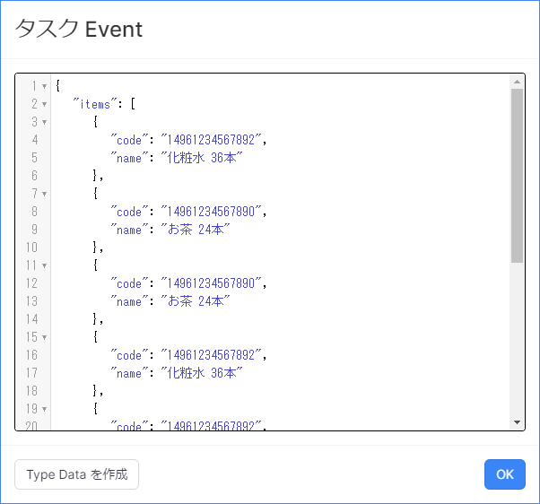
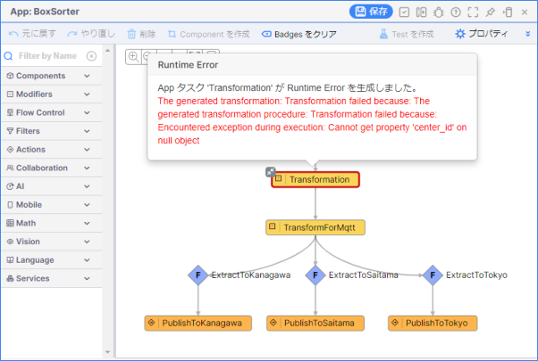
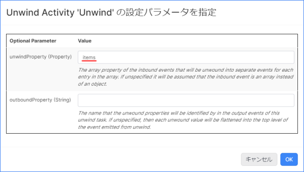

# 荷物仕分けアプリケーション開発 (Unwind)

## 実装の流れ

下記の流れで実装していきます。

1. 【準備】Namespace の作成と Project のインポート、データジェネレータの準備
1. 【動作確認】既存のアプリケーションの動作確認
1. 【App Builder】既存のアプリケーションの修正
1. 【Type】未登録データ保存容の Type の作成
1. 【App Builder】ボックスソーターアプリの改修
1. 【動作確認】仕分け結果の確認

> リソース名やタスク名は任意のものに変更しても構いません。
> 
## 目次

- [荷物仕分けアプリケーション開発 (Unwind)](#荷物仕分けアプリケーション開発-unwind)
  - [実装の流れ](#実装の流れ)
  - [目次](#目次)
  - [アプリケーションが前提とする受信内容](#アプリケーションが前提とする受信内容)
  - [1. Namespace の作成と Project のインポート](#1-namespace-の作成と-project-のインポート)
    - [1-1. Namespace の作成](#1-1-namespace-の作成)
    - [1-2. Project のインポート](#1-2-project-のインポート)
  - [2. データジェネレータの準備](#2-データジェネレータの準備)
  - [3. 既存のアプリケーションの動作確認](#3-既存のアプリケーションの動作確認)
  - [4. App Builder を用いたボックスソーターアプリの修正](#4-app-builder-を用いたボックスソーターアプリの修正)
    - [4-1. サブスクライブしたメッセージの確認](#4-1-サブスクライブしたメッセージの確認)
    - [4-2. Transformation タスクのエラー原因の確認](#4-2-transformation-タスクのエラー原因の確認)
    - [4-3. 配列の並列分散処理の実装](#4-3-配列の並列分散処理の実装)
  - [5. 仕訳処理が正しく行われていることを確認する](#5-仕訳処理が正しく行われていることを確認する)
  - [追加課題](#追加課題)
  - [実装サンプル](#実装サンプル)

## アプリケーションが前提とする受信内容

```json
[
    {
        "code": "14961234567890",
        "name": "お茶 24本",
        "time": "2023-11-14 07:58:37"
    }
]
```

## 1. Namespace の作成と Project のインポート

### 1-1. Namespace の作成

アプリケーションを実装する前に新しく Namespace を作成し、作成した Namespace に切り替えます。  

詳細は下記をご確認ください。  
[Vantiq の Namespace と Project について](/vantiq-introduction/apps-development/vantiq-basic/namespace/namespace.md)

### 1-2. Project のインポート

Namespace の切り替えが出来たら、 Project のインポートを行います。  
**ボックスソーター（初級編・MQTT）** の Project をインポートしてください。  

詳細は下記を参照してください。  
[Project の管理について - Project のインポート](/vantiq-introduction/apps-development/vantiq-basic/project/project.md#project-のインポート)

## 2. データジェネレータの準備

Google Colaboratory を使用して、ダミーデータの生成します。  

**データジェネレータ** は下記のものを利用します。

- [BoxSorterDataGenerator (Unwind)](/vantiq-google-colab/code/box-sorter_data-generator_unwind.ipynb)

設定方法は下記を参照してください。  
[ボックスソーター（中級編・CachedEnrich) - 2. データジェネレータの準備](/vantiq-introduction/apps-development/apps-boxsorter/cachedenrich/instruction.md#2-データジェネレータの準備)

> **注意点**  
> データジェネレータの種類が **ボックスソーター（中級編・CachedEnrich）** とは異なるので注意してください。

## 3. 既存のアプリケーションの動作確認

**Source** の **データの受信テスト** からデータが正しく受信できているか確認します。  

詳細は下記を参照してください。  
[ボックスソーター（中級編・CachedEnrich) - 3. 既存のアプリケーションの動作確認](/vantiq-introduction/apps-development/apps-boxsorter/cachedenrich/instruction.md#3-既存のアプリケーションの動作確認)

## 4. App Builder を用いたボックスソーターアプリの修正

アプリケーションでエラーが発生しているので、まずは既存アプリケーションの修正を行います。

### 4-1. サブスクライブしたメッセージの確認

Google Colaboratory からパブリッシュしたメッセージを確認します。  

#### 入力データの確認

1. `BoxSorter` App のペインを開きます。

1. `ReceiveBoxInfo` タスクをクリックし、 `タスク Events を表示` をクリックします。

1. メッセージを何件かクリックして `タスク Event` を表示します。
   
   

1. 入力データのフォーマットを確認します。
   
   |  |  |
   |-|-|

### 4-2. Transformation タスクのエラー原因の確認

現状のアプリケーションでは、 `Transformation` タスクでエラーが発生しています。  
まずはエラーの原因を調べます。

エラーの内容を確認すると次のように書かれています。  

```
The generated transformation: Transformation failed because: The generated transformation procedure: Transformation failed because: Encountered exception during execution: Cannot get property 'center_id' on null object
```



入力フォーマットがオブジェクトから配列に変わったことで、 `center_id` が取得できなくなり、エラーが発生してしまっていることが分かります。

### 4-3. 配列の並列分散処理の実装

#### Unwind Activity の実装

1. App ペイン左側の `Flow Control` の中から `Unwind` を選択し、 `ReceiveBoxInfo` タスクと `AttachCondition` タスクの間の **矢印** の上にドロップします。

   

1. `Unwind` タスクをクリックし、 `Configuration` の `クリックして編集` を開きます。  
   以下の設定を行いアプリケーションを保存します。

   |Optional Parameter|Value|
   |-|-|
   |unwindProperty (Property)|items|

   

1. `Unwind` タスクの `タスク Events を表示` をクリックし、配列のデータが個々のイベントに別れていることを確認します。

## 5. 仕訳処理が正しく行われていることを確認する

アプリケーション全体の動作を確認し、正しく仕訳処理が行われていることを確認します。  

## 追加課題

今回のワークショップでは、 MQTT ブローカーから飛んでくるデータが必ず配列になっていました。  
では、 MQTT ブローカーから飛んでくるデータに配列のデータと配列ではないデータが混ざっている場合はどうなるでしょうか？  

下記のいずれかのジェネレーターを利用して、アプリケーションの実装を行ってみましょう。  

- Google Colab
  - [BoxSorterDataGenerator (Unwind Ex)](/vantiq-google-colab/code/box-sorter_data-generator_unwind_ex.ipynb)
- Pyehon
  - [BoxSorterDataGenerator (Unwind Ex)](/vantiq-google-colab/code/box-sorter_data-generator_unwind_ex.py)

入力データは下記を参考にしてください。

**配列のデータ**

```json
{
   "items": [
      {
         "code": "14961234567893"
         , "name": "ワイン 12本"
      }
      , {
         "code": "14961234567892"
         , "name": "化粧水 36本"
      }
   ]
   , "time": "2023-10-16 15:37:30"
}
```

**配列ではないデータ**

```json
{
   "code": "14961234567893"
   , "name": "ワイン 12本"
   , "time": "2023-10-16 15:37:30"
}
```

## 実装サンプル

- [ボックスソーター（中級編・Unwind）の実装サンプル（Vantiq 1.37）](./../data/box_sorter_unwind_1.37.zip)
- [ボックスソーター（中級編・Unwind Ex）の実装サンプル（Vantiq 1.37）](./../data/box_sorter_unwind_ex_1.37.zip)

以上
