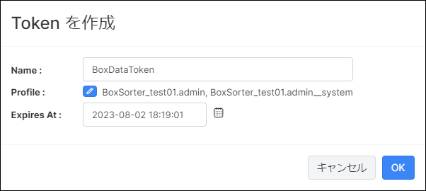
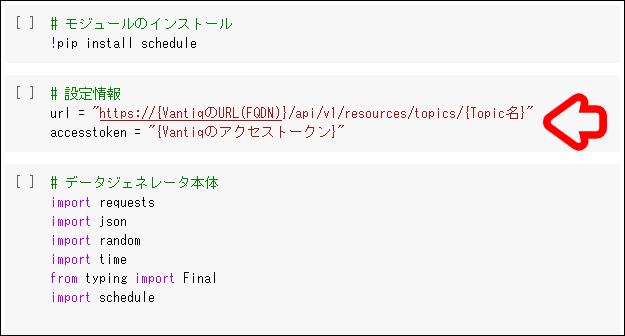

# 荷物仕分けアプリケーション開発 (Beginner)

## 実装の流れ

下記の流れで実装していきます。

1. 【準備】Namespace の作成とデータジェネレータの準備
1. 【Topic】Vantiq で Google Colaboratory 用のエンドポイントを作成する
1. 【App Builder】荷物仕分けアプリの開発
1. 【動作確認】送信結果が正しく仕分けされているか確認する

## 目次

- [荷物仕分けアプリケーション開発 (Beginner)](#荷物仕分けアプリケーション開発-beginner)
  - [実装の流れ](#実装の流れ)
  - [目次](#目次)
  - [実装詳細](#実装詳細)
    - [アプリケーションが前提とする受信内容](#アプリケーションが前提とする受信内容)
    - [実装するリソース](#実装するリソース)
  - [1.【準備】Namespace の作成](#1準備namespace-の作成)
  - [2.【準備】Google Colaboratory の動作確認](#2準備google-colaboratory-の動作確認)
    - [Vantiq Access Token の発行](#vantiq-access-token-の発行)
    - [Google Colaboratory の設定](#google-colaboratory-の設定)
  - [3. 【Topic】Vantiqで Google Colaboratory のデータを受信する](#3-topicvantiqで-google-colaboratory-のデータを受信する)
    - [Topic の作成](#topic-の作成)
  - [4. 【App Builder】荷物仕分けアプリケーション開発](#4-app-builder荷物仕分けアプリケーション開発)
    - [1. アプリケーションの作成](#1-アプリケーションの作成)
    - [2.【EventStream】Topic で受信した内容をアプリケーションで受け取る](#2eventstreamtopic-で受信した内容をアプリケーションで受け取る)
    - [3. Type の作成](#3-type-の作成)
    - [4.【Enrich】仕分け条件をイベントに追加する](#4enrich仕分け条件をイベントに追加する)
    - [5. 【Filter】条件に合致したイベントだけを通過させ、仕分けする](#5-filter条件に合致したイベントだけを通過させ仕分けする)
    - [6. 【LogStream】仕分け指示をログとして表示](#6-logstream仕分け指示をログとして表示)
  - [5.【動作確認】送信結果が正しく仕分けされているか確認する](#5動作確認送信結果が正しく仕分けされているか確認する)
  - [補足説明](#補足説明)
  - [参考情報](#参考情報)
    - [プロジェクトファイル](#プロジェクトファイル)

## 実装詳細

### アプリケーションが前提とする受信内容

```json
{
    "code": "14961234567890",
    "name": "お茶 24本"
}
```

|項目|データ型|
|-|-|
|code|String|
|name|String|

### 実装するリソース

#### Topic

|種別|リソース名|役割|
|-|-|-|
|REMOTE|/BoxInfoApi|荷物の仕分け情報の受信用エンドポイント|

#### App

|リソース名|役割|
|-|-|
|BoxSorter|荷物の仕分け|

##### BoxSorter 詳細

|Activity Pattern|タスク名|役割|
|-|-|-|
|EventStream|ReceiveBoxInfo|Topic で受信した内容をアプリで受け取る|
|Enrich|AttachCondition|仕分け条件をイベントに追加する<br/><span style="color:blue;">※本ワークショップでは荷物を物流センター単位で仕分けます<span>|
|Filter|ExtractToTokyo<br/>ExtractToKanagawa<br/>ExtractToSaitama|条件に合致したイベントだけを通過させ、仕分けする|
|LogStream|LogToTokyo<br/>LogToKanagawa<br/>LogToSaitama|仕分け指示を Log に表示する|

> リソース名やタスク名は任意のものに変更しても構いません。

> App Builder や Activity Pattern の基礎について確認したい方は [こちら](/vantiq-apps-development/1-day-workshop/docs/jp/5-02_AppBuilder.md) を参照してください。

#### Type

|種別|リソース名|役割|
|-|-|-|
|Standard|sorting_condition|仕分けに必要な情報を保持|

##### sorting_condition 詳細

|プロパティ名|データ型|論理名|
|-|-|-|
|code|String|送り先コード|
|center_id|Integer|物流センターの ID|
|center_name|String|物流センター名|

> Vantiq のリソースの基礎について確認したい方は [こちら](/vantiq-apps-development/1-day-workshop/docs/jp/0-10_BasicResources.md) を参照してください。

## 1.【準備】Namespace の作成

アプリケーションを実装する前に新しく Namespace を作成し、作成した Namespace に切り替えます。  

詳細は下記をご確認ください。  
[Vantiq の Namespace と Project について](/vantiq-introduction/apps-development/vantiq-basic/namespace/readme.md)

## 2.【準備】Google Colaboratory の動作確認

Google Colaboratory を使用して、ダミーデータの生成します。  
Google Colaboratory を利用するにあたり、事前に **Vantiq Access Token** を発行する必要があります。  

### Vantiq Access Token の発行

1. メニューバーの `管理` -> `Advanced` -> `Access Tokens` -> `+ 新規` をクリックし Token の新規作成画面を開く

   

1. 以下の内容を設定し、保存する

   |項目|設定値|備考|
   |-|-|-|
   |Name|BoxDataToken|左記以外の名前でも問題ありません。|

   

1. 発行された `Access Token` をクリックして、クリップボードにコピーしておく

   

### Google Colaboratory の設定

1. 下記のリンクから **データジェネレータ** のページを開く

   - [BoxSorterDataGenerator (Beginner)](/vantiq-google-colab/docs/jp/box-sorter_data-generator_beginner.ipynb)

      > Google Colaboratory を利用する際は Google アカウントへのログインが必要になります。

1. Github のページ内に表示されている、下記の `Open in Colab` ボタンをクリックして、 Google Colaboratory を開く

   

1. `# 設定情報` に以下の内容を入力する

   |項目|設定値|備考|
   |-|-|-|
   |url|https://{VantiqのURL(FQDN)}/api/v1/resources/topics//BoxInfoApi|SSL化されていないサーバーの場合は、 `https://` を `http://` に置き換えてください。|
   |accesstoken|7tFxPj4JuNFnuwmGcEadU_6apA1r3Iji2N7AZS5HuVU=|上記で発行した Access Token|

   

1. 上から順に1つずつ `再生ボタン` を押していく  
   実行が終わるのを待ってから、次の `再生ボタン` を押してください。  

   

1. エラーが発生していないことを確認し、 `# データジェネレータ本体` の左側の `停止ボタン` を押して、一旦、停止させておく

## 3. 【Topic】Vantiqで Google Colaboratory のデータを受信する

サーバーからデータを受信したい場合、エンドポイントが必要です。これは Vantiq でも同じです。  
Vantiq の Topic がエンドポイントになります。

### Topic の作成

1. メニューバーの `追加` -> `Advanced` -> `Topic...` -> `+ 新規 Topic` をクリックし Topic の新規作成画面を開く
1. 以下の内容を設定し、保存する

   |項目|設定値|設定箇所|
   |-|-|-|
   |Name|/BoxInfoApi|-|
   > 上記以外にも設定できる項目はありますが本ワークショップでは使用しません。

1. データを受信できることを確認する
   1. `/BoxInfoApi` Topicのペインを開き `データの受信テスト` をクリックする
      > `Subscription: /BoxInfoApi` というペインが新たに開かれます。データを受信するとここに取得した内容が表示されます。
   1. Google Colaboratory のデータジェネレータを起動する
   1. `Subscription: /BoxInfoApi` に Google Colaboratory から受信した内容が表示されることを確認する

      

## 4. 【App Builder】荷物仕分けアプリケーション開発

この手順からアプリケーション開発を開始します。  
Google Colaboratory から取得したデータをイベントとして、処理を実装していきます。

### 1. アプリケーションの作成

1. メニューバーの `追加` -> `Advanced` -> `App...` -> `+ 新規 App` をクリックしアプリケーションの新規作成画面を開く

1. `Name` に `BoxSorter` と入力し `OK` をクリックする

   > `BoxSorter` のペインが開かれますのでここから開発作業を進めていきます。デフォルトで `Initiate` タスクが作成されます。

   > アプリケーションのルートとなるタスクに設定される Activity Pattern は常に `EventStream` Activity になります。

   

### 2.【EventStream】Topic で受信した内容をアプリケーションで受け取る

`EventStream` を使って外部から取得したデータをイベントとしてアプリケーションに渡します。

1. `Initiate` タスクをクリックし、 `Name` に `ReceiveBoxInfo` と入力する
1. `Configuration` の `クリックして編集` から以下の内容を入力し、 `OK` をクリックする

   |項目|設定値|
   |-|-|
   |inboundResource|topics|
   |inboundResourceId|/BoxInfoApi|

1. App Builder のペインの上部にあるフロッピーディスクのアイコンをクリックし、アプリケーションを保存する

1. `ReceiveBoxInfo` タスクを右クリックし、 `タスク Events を表示` をクリックする
   > `Subscription:BoxSorter_ReceiveBoxInfo` が開かれます。ここには ReceiveBoxInfo タスクの処理結果が表示されます。

1. Google Colaboratory のデータジェネレーターを起動し、ダミーデータを送信します。送信された内容が `Subscription:BoxSorter_ReceiveBoxInfo` に表示されることを確認する
   > この手順で、アプリケーションが Topic で受信した内容を扱える状態まで実装できています。

### 3. Type の作成

このアプリケーションが受け取る元の内容は以下のように `code` と `name` だけが含まれているデータです。

```json
{
    "code": "14961234567890",
    "name": "お茶 24本"
}
```

仕分けをしていくにあたり、その判断材料となる情報を追加する必要があります。  
Vantiq では `Enrich` という Activity Pattern が用意されており、イベントに対して Type に保存されたレコードの内容を追加することができます。  

|項目|設定値|詳細|
|-|-|-|
|Enrich|イベントに Type のレコードを追加する|毎回 MongoDB に対してクエリを発行する|

あらかじめ仕分けの判断材料となる情報を保持した Type を作成しておき、これらの Activity でその Type の情報を取得してイベントに追加します。  
一旦アプリケーションから離れ、 Type の作成とレコード追加を行います。  

1. `sorting_condition` Type を作成する
   1. メニューバーの `追加` -> `Type...` -> `+ 新規 Type` をクリックして Type の新規作成画面を開き、以下の内容を入力して `OK` をクリックする

      |項目|設定値|
      |-|-|
      |Name|sorting_condition|
      |Role|standard|

   1. `sorting_condition` のペインが表示されるので、タブごとに以下の設定を行い保存する

      **Properties タブ**
      |プロパティ名|データ型|Required|
      |-|-|-|
      |code|String|✅|
      |center_id|Integer|✅|
      |center_name|String|✅|

      **Indexes タブ**
      |項目|設定値|Is Unigue|
      |-|-|-|
      |Key|code|✅|

      **Natural Keys タブ**
      |項目|設定値|
      |-|-|
      |Key|code|

1. `sorting_condition` Type にデータをインポートする
   1. メニューバーの `Projects` -> `インポート...` を開き、 `Select Import Type:` を `Data` に設定する
   1. `インポートする CSV ファイルまたは JSON ファイルをここにドロップ` の箇所に [sorting_condition.csv](./../data/sorting_condition.csv) をドロップし `インポート` をクリックする

      > Type にレコードをインポートする際は `Data` を選択する必要があります。  
      > デフォルトは `Projects` になっているので注意してください。  

      > インポートする CSV ファイルのファイル名は `sorting_condition.csv` になっている必要があります。  
      > ファイル名が異なる場合は `sorting_condition.csv` にリネームしてください。  

   1. `sorting_condition` Type のペインを開き、上部にある `すべてのレコードを表示` をクリックしてインポートが成功しているか確認する

      |center_id|center_name|code|
      |-|-|-|
      |1|東京物流センター|14961234567890|
      |2|神奈川物流センター|14961234567892|
      |3|埼玉物流センター|14961234567893|

これで Type とレコードが用意できたのでアプリケーションの開発に戻ります。  

### 4.【Enrich】仕分け条件をイベントに追加する

`Enrich` Activity Pattern を使用して、 Type のデータを追加します。

1. `ReceiveBoxInfo` タスクを右クリックし、 `新規タスクとリンク` から新しいタスクを後続に追加する
   1. `新規タスクとリンク` ダイアログが表示されるので以下の内容を入力し `OK` をクリックする

      |項目|設定値|
      |-|-|
      |Activity Pattern|Enrich|
      |タスク Name|AttachCondition|

   1. `AttachCondition` タスクをクリックし、 `Configuration` から以下の設定を行いアプリケーションを保存する

      <details>
      <summary>Vantiq Version 1.34 の場合</summary>

      |項目|設定値|備考|
      |-|-|-|
      |associatedType|sorting_condition|-|

      `foreignKeys` の `<null>` をクリックし、下記の設定を行います。

      1. `+ アイテムの追加` をクリックする

         |項目|設定値|備考|
         |-|-|-|
         |Value|code|この項目に設定したプロパティがクエリの条件になる|
      </details>
      
      <details>
      <summary>Vantiq Version 1.36 の場合</summary>
      
      |項目|設定値|備考|
      |-|-|-|
      |associatedType|sorting_condition|-|

      `foreignKeys` の `<null>` をクリックし、下記の設定を行います。

      1. `+ 外部キーのプロパティを追加する` をクリックする

         |項目|設定値|備考|
         |-|-|-|
         |Associated Type Property|code|Type 側のプロパティ|
         |Foreign Key Expression|event.code|イベント側のプロパティ|
      </details>

   > VAIL で書くとすると `SELECT ONE FROM sorting_condition WHERE code == code` ということになります。

1. Google Colaboratory からダミーデータを送信し、 Enrich の動作を確認する
   1. `AttachCondition` タスクを右クリックし、 `タスク Events を表示` をクリックして Subscription を表示する
   1. Google Colaboratory のデータジェネレータを起動し、ダミーデータを送信する
      > 送信先のエンドポイントなどはこれまでと同じです。

   1. Vantiq の開発画面に戻り、表示しておいた Subscription に以下のようなイベントが表示されていることを確認する

      ```json
      {
          "code": "14961234567890",
          "name": "お茶 24本",
          "sorting_condition": {
              "_id": "649d30c7c32b66791581af76",
              "center_id": 1,
              "center_name": "東京物流センター",
              "code": "14961234567890",
              "ars_namespace": "BoxSorter",
              "ars_version": 1,
              "ars_createdAt": "2023-06-29T07:20:39.157Z",
              "ars_createdBy": "e9cc46d7-77cc-4929-8261-40ddceb8b143"
          }
      }
      ```

      > `_id` や `ars_***` はシステム側で自動生成されるプロパティのため、この例と同じにはなりません。

      `sorting_condition` というプロパティが追加されており、物流センターに関する情報を追加することができました。

### 5. 【Filter】条件に合致したイベントだけを通過させ、仕分けする

特定の物流センターのイベントのみが通過できるフローを実装することで仕分けを行います。  
今回は「東京」「神奈川」「埼玉」の3つの物流センター単位で仕分けをしますので `Filter` Activity を設定したタスクを3つ実装します。

物流センターとその ID は以下の関係になっています。
|物流センター|物流センターID|
|-|-|
|東京|1|
|神奈川|2|
|埼玉|3|

この物流センターID `center_id` で仕分けをします。

1. `AttachCondition` タスクの次に以下のタスクを追加し、アプリケーションを保存する
   1. 東京物流センター用

      |項目|設定値|
      |-|-|
      |Activity Pattern|Filter|
      |Task Name|ExtractToTokyo|

      #### ExtractToTokyo の設定

      |項目|設定値|備考|
      |-|-|-|
      |condition|event.sorting_condition.center_id == 1|東京物流センターのIDは `1`|

   1. 神奈川物流センター用

      |項目|設定値|
      |-|-|
      |Activity Pattern|Filter|
      |Task Name|ExtractToKanagawa|

      #### ExtractToKanagawa の設定

      |項目|設定値|備考|
      |-|-|-|
      |condition|event.sorting_condition.center_id == 2|神奈川物流センターのIDは `2`|

   1. 埼玉物流センター用

      |項目|設定値|
      |-|-|
      |Activity Pattern|Filter|
      |Task Name|ExtractToSaitama|

      #### ExtractToSaitama の設定

      |項目|設定値|備考|
      |-|-|-|
      |condition|event.sorting_condition.center_id == 3|埼玉物流センターのIDは `3`|

1. 3つの `ExtractTo***` タスクで `タスク Events を表示` を行い、それぞれ適切なイベントのみ通過しているか確認する
   1. Google Colaboratory からダミーデータを送信する

   1. 各 Subscription でイベントを適切なイベントだけ通過しているか確認する
      - `ExtractToTokyo` の Subscription に以下のイベント **のみ** が表示されていること

        ```json
        {
            "code": "14961234567890",
            "name": "お茶 24本",
            "sorting_condition": {
                "_id": "649d30c7c32b66791581af76",
                "center_id": 1,
                "center_name": "東京物流センター",
                "code": "14961234567890",
                "ars_namespace": "BoxSorter",
                "ars_version": 1,
                "ars_createdAt": "2023-06-29T07:20:39.157Z",
                "ars_createdBy": "e9cc46d7-77cc-4929-8261-40ddceb8b143"
            }
        }
        ```

      - `ExtractToKanagawa` の Subscription に以下のイベント **のみ** が表示されていること

        ```json
        {
            "code": "14961234567892",
            "name": "化粧水 36本",
            "sorting_condition": {
                "_id": "649d30c7c32b66791581af77",
                "center_id": 2,
                "center_name": "神奈川物流センター",
                "code": "14961234567892",
                "ars_namespace": "BoxSorter",
                "ars_version": 1,
                "ars_createdAt": "2023-06-29T07:20:39.200Z",
                "ars_createdBy": "e9cc46d7-77cc-4929-8261-40ddceb8b143"
            }
        }
        ```

      - `ExtractToSaitama` の Subscription に以下のイベント **のみ** が表示されていること

        ```json
        {
            "code": "14961234567893",
            "name": "ワイン 12本",
            "sorting_condition": {
                "_id": "649d30c7c32b66791581af78",
                "center_id": 3,
                "center_name": "埼玉物流センター",
                "code": "14961234567893",
                "ars_namespace": "BoxSorter",
                "ars_version": 1,
                "ars_createdAt": "2023-06-29T07:20:39.244Z",
                "ars_createdBy": "e9cc46d7-77cc-4929-8261-40ddceb8b143"
            }
        }
        ```

### 6. 【LogStream】仕分け指示をログとして表示

ここまでの実装で仕分けができるようになりましたので、その結果を **Log メッセージ** に表示します。

1. 各 `ExtractTo***` タスクの次に、それぞれ以下のタスクを追加してからアプリケーションを保存する

   1. `ExtractToTokyo` タスクの次:

      |項目|設定値|
      |-|-|
      |Activity Pattern|LogStream|
      |タスク Name|LogToTokyo|

      #### LogToTokyo の設定

      |項目|設定値|備考|
      |-|-|-|
      |level|info|-|

   1. `ExtractToKanagawa` タスクの次:

      |項目|設定値|
      |-|-|
      |Activity Pattern|LogStream|
      |タスク Name|LogToKanagawa|

      #### LogToKanagawa の設定

      |項目|設定値|備考|
      |-|-|-|
      |level|info|-|

   1. `ExtractToSaitama` タスクの次:

      |項目|設定値|
      |-|-|
      |Activity Pattern|LogStream|
      |タスク Name|LogToSaitama|

      #### LogToSaitama の設定

      |項目|設定値|備考|
      |-|-|-|
      |level|info|-|

## 5.【動作確認】送信結果が正しく仕分けされているか確認する

Google Colaboratory からダミーデータを送信しておき、正しく仕分けされるか確認します。

1. Google Colaboratory からダミーデータを送信する

1. Log メッセージ 画面を表示する
   1. 画面右下の `Debugging` をクリックする

   1. 右側の `Errors` をクリックし、 `Log メッセージ` にチェックを入れる

1. 各物流センターごとに正しく仕分け指示が表示されていることを確認する

   **例: 各物流センターごとに Log メッセージ が表示されている**

   

## 補足説明

Type の NaturalKey については、下記を参照してください。

- [Type の NaturalKey とは？](/vantiq-apps-development/docs/jp/reverse-lookup.md#type-の-naturalkey-とは)

## 参考情報

### プロジェクトファイル

- [荷物仕分けアプリ (Beginner) の実装サンプル（Vantiq 1.34）](./../data/box_sorter_beginner_1.34.zip)
- [荷物仕分けアプリ (Beginner) の実装サンプル（Vantiq 1.36）](./../data/box_sorter_beginner_1.36.zip)

以上
