# ボックスソーター（MQTT）

## アプリケーションが想定している受信内容

```json
{
    "code": "14961234567890",
    "name": "お茶 24本",
    "time": "2023-11-14 07:58:37"
}
```

## 目次

- [ボックスソーター（MQTT）](#ボックスソーターmqtt)
  - [アプリケーションが想定している受信内容](#アプリケーションが想定している受信内容)
  - [目次](#目次)
  - [1. Namespace の作成と Project のインポート](#1-namespace-の作成と-project-のインポート)
    - [1-1. Namespace の作成](#1-1-namespace-の作成)
    - [1-2. Project のインポート](#1-2-project-のインポート)
  - [2. データジェネレータの準備](#2-データジェネレータの準備)
    - [2-1. Google Colaboratory の設定](#2-1-google-colaboratory-の設定)
  - [3. Source を用いた MQTT ブローカーからのサブスクライブ](#3-source-を用いた-mqtt-ブローカーからのサブスクライブ)
    - [3-1. Source の作成](#3-1-source-の作成)
    - [3-2. データの受信テスト](#3-2-データの受信テスト)
  - [4. Service Builder を用いたボックスソーターアプリの改修](#4-service-builder-を用いたボックスソーターアプリの改修)
    - [4-1. 【Service Builder】Service ペインの表示](#4-1-service-builderservice-ペインの表示)
    - [4-2. 【Implement】Source Event Handler の作成](#4-2-implementsource-event-handler-の作成)
    - [4-3. 【EventStream】EventStream の修正](#4-3-eventstreameventstream-の修正)
    - [4-4. 【Transformation】イベントデータの修正](#4-4-transformationイベントデータの修正)
    - [4-5. 【Transformation】MQTT フォーマットへの変換](#4-5-transformationmqtt-フォーマットへの変換)
    - [4-6. 【Filter】仕分け条件の修正](#4-6-filter仕分け条件の修正)
    - [4-7. 【LogStream】デバッグ用のログの削除](#4-7-logstreamデバッグ用のログの削除)
    - [4-8. 【Source】送信用の MQTT Source の作成](#4-8-source送信用の-mqtt-source-の作成)
    - [4-9. 【PublishToSource】MQTT ブローカーへのパブリッシュ](#4-9-publishtosourcemqtt-ブローカーへのパブリッシュ)
  - [5. 仕分け結果の確認](#5-仕分け結果の確認)
    - [5-1. Google Colaboratory の設定](#5-1-google-colaboratory-の設定)
    - [5-2. サブスクライブしたメッセージの確認](#5-2-サブスクライブしたメッセージの確認)
  - [Project のエクスポート](#project-のエクスポート)
  - [ワークショップの振り返り](#ワークショップの振り返り)
  - [参考情報](#参考情報)
    - [プロジェクトファイル](#プロジェクトファイル)

## 1. Namespace の作成と Project のインポート

### 1-1. Namespace の作成

アプリケーションを実装する前に新しく Namespace を作成し、作成した Namespace に切り替えます。  

詳細は下記をご確認ください。  
[Vantiq の Namespace と Project について](/vantiq-introduction/apps-development/vantiq-basic/namespace/readme.md)

### 1-2. Project のインポート

Namespace の切り替えが出来たら、 Project のインポートを行います。  
**ボックスソーター（Transformation）** の Project をインポートしてください。  

詳細は下記を参照してください。  
[Project の管理について - Project のインポート](/vantiq-introduction/apps-development/vantiq-basic/project/readme.md#project-のインポート)

## 2. データジェネレータの準備

Google Colaboratory を使用して、ダミーデータの生成します。  

ダミーデータを送受信するあたって、以下の MQTT ブローカーを使用します。
|項目|設定値|備考|
|-|-|-|
|Server URI|mqtt://public.vantiq.com:1883|-|
|Topic|/workshop/jp/**yourname**/boxinfo|`yourname` の箇所に任意の値を入力する ※英数字のみ|
>この MQTT ブローカーはワークショップ用のパブリックなブローカーです。認証は不要です。  
>上記以外の MQTT ブローカーを利用しても問題ありません。

### 2-1. Google Colaboratory の設定

1. 下記のリンクから **データジェネレータ** のページを開きます。

   - [BoxSorterDataGenerator（MQTT）](/vantiq-google-colab/code/box-sorter_data-generator_mqtt.ipynb)

   > Google Colaboratory を利用する際は Google アカウントへのログインが必要になります。

1. Github のページ内に表示されている、下記の `Open in Colab` ボタンをクリックして、 Google Colaboratory を開きます。

   

1. `# MQTTブローカー設定` に以下の内容を入力します。

   |項目|設定値|備考|
   |-|-|-|
   |broker|public.vantiq.com|※変更不要です。|
   |port|1883|※変更不要です。|
   |topic|/workshop/jp/**yourname**/boxinfo|`yourname` の箇所に任意の値を入力します。（※英数字のみ）|
   |client_id||※変更不要です。|
   |username||※変更不要です。|
   |password||※変更不要です。|

1. 上から順に1つずつ `再生ボタン` を押していきます。  
   実行が終わるのを待ってから、次の `再生ボタン` を押してください。  

   1. `# ライブラリのインストール`（※初回のみ）
   1. `# ライブラリのインポート`（※初回のみ）
   1. `# MQTTブローカー設定`
   1. `# 送信データ設定`
   1. `# MQTT Publisher 本体`

## 3. Source を用いた MQTT ブローカーからのサブスクライブ

MQTT ブローカーと接続したい場合、 MQTT クライアントが必要です。  
これは Vantiq でも同じです。  
Vantiq の Source は MQTT に対応しており、これがクライアントになります。

### 3-1. Source の作成

1. メニューバーの `追加` -> `Source...` -> `+ 新規 Source` をクリックし Source の新規作成画面を開きます。

   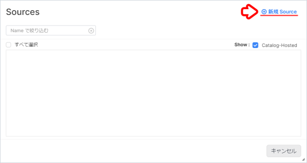

1. 以下の内容を設定します。

   |項目|設定値|
   |-|-|
   |Source Name|BoxInfoMqtt|
   |Package|com.example|
   |Source Type|MQTT|

   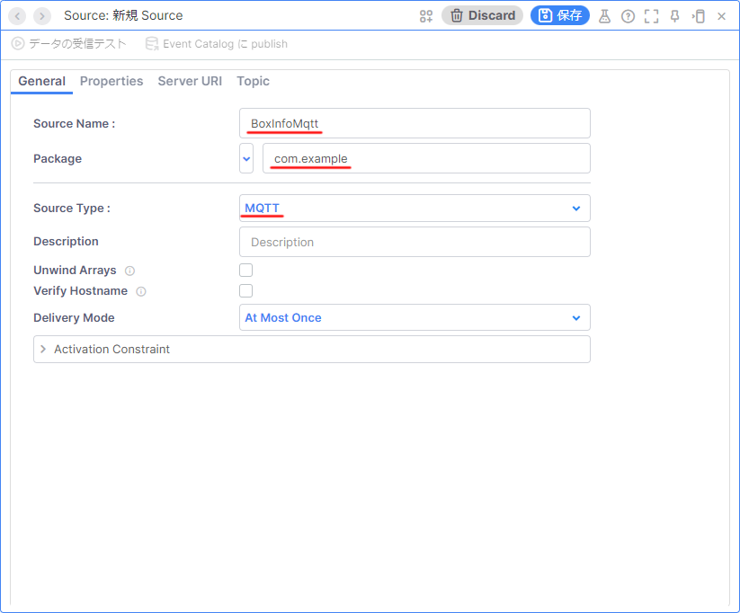

1. `Server URI` タブに切り替えて、 `+ Server URI を追加` をクリックします。

   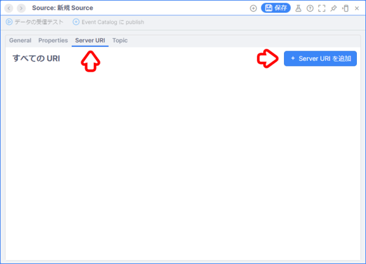

1. 下記の内容を設定し、 `OK` をクリックします。

   |項目|設定値|
   |-|-|
   |Server URI|mqtt://public.vantiq.com:1883|

   

1. `Topic` タブに切り替えて、 `+ Topic を追加` をクリックします。

   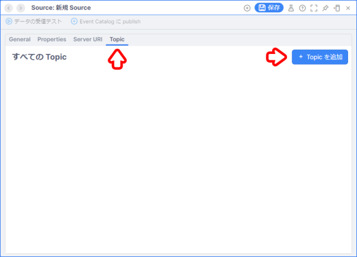

1. 下記の内容を設定し、 `OK` をクリックします。

   |項目|設定値|備考|
   |-|-|-|
   |Topic|/workshop/jp/**yourname**/boxinfo|※`yourname` の箇所には Google Colaboratory の設定時に設定した値を使用する|`Topic` タブ -> `+ Topic を追加`|

   

1. 全ての設定が終わったら、 Source を保存します。

   > 上記以外にも設定できる項目はありますが本ワークショップでは使用しません。

### 3-2. データの受信テスト

1. `com.example.BoxInfoMqtt` Source のペインを開き `データの受信テスト` をクリックします。

   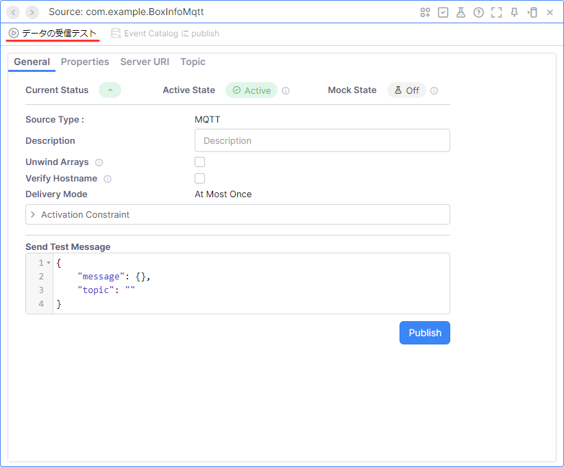

1. `Subscription:com.example.BoxInfoMqtt` に Google Colaboratory から送信した内容が表示されることを確認します。

   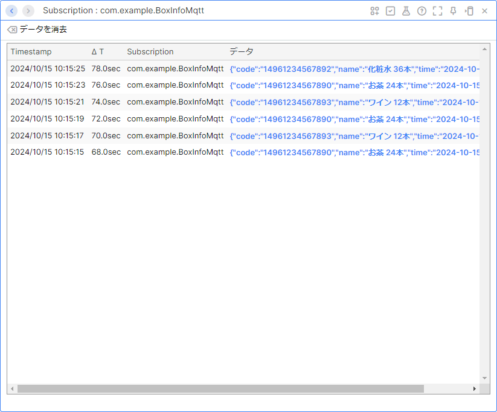

   > `Subscription:com.example.BoxInfoMqtt`というペインが新たに開かれます。メッセージをサブスクライブするとここに取得した内容が表示されます。

## 4. Service Builder を用いたボックスソーターアプリの改修

この手順からアプリケーションの改修を開始します。  

### 4-1. 【Service Builder】Service ペインの表示

1. 画面左側の **Project Contents** から `BoxSorter` Service を開きます。

   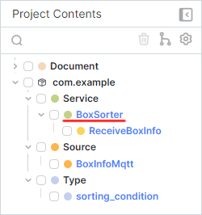

### 4-2. 【Implement】Source Event Handler の作成

1. `Implement` タブの `Source` の `＋` ボタンをクリックし、 `既存の App の移行` を選択します。  

   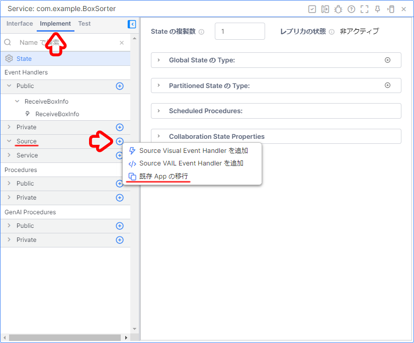

1. `Event Handlers` にチェックを入れ、 `com.example.BoxSorter.ReceiveBoxInfo` を選択します。  

   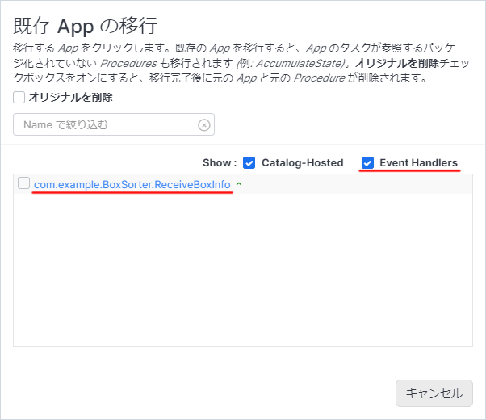

1. 以下の内容を入力して `作成` をクリックします。

   |項目|設定値|
   |---|---|
   |Name|ReceiveBoxInfoMqtt|

   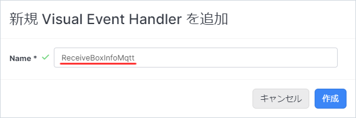

   > **注意**  
   > この時点ではアプリケーションを保存しないでください。  

### 4-3. 【EventStream】EventStream の修正

1. `EventStream` タスクをクリックし、 `Configuration` の `クリックして編集` から以下の内容を入力し、 `OK` をクリックします。

   |項目|設定値|
   |---|---|
   |inboundResource (Enumerated)|sources|
   |inboundResourceId (String)|com.example.BoxInfoMqtt|

   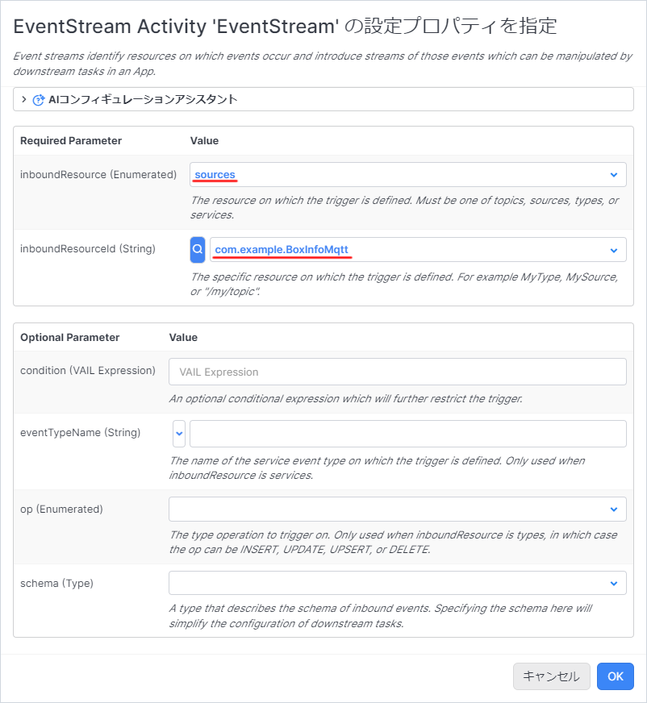

1. **Service** を保存し、アプリケーションが正しく動作することを確認します。

### 4-4. 【Transformation】イベントデータの修正

今の状態では、新しく追加された `time` が欠落してしまっているため `Transformation` タスクを修正します。  

1. `Transformation` タスクをクリックし、 `Configuration` の `クリックして編集` を開きます。  
   `transformation (Union)` から以下の内容を入力し、 `OK` をクリックします。
   
   |Outbound Property|Transformation Expression|
   |-|-|
   |code|event.code|
   |name|event.name|
   |center_id|event.sorting_condition.center_id|
   |center_name|event.sorting_condition.center_name|
   |time|event.time|

   > 順番は必要に応じて入れ替えてください。

   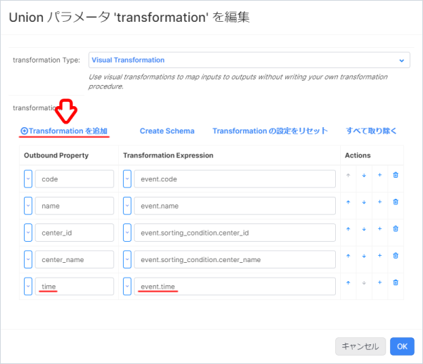

1. **Service** を保存し、イベントに `time` が含まれていることを確認します。

### 4-5. 【Transformation】MQTT フォーマットへの変換

今回のアプリケーションでは、仕分け指示を MQTT ブローカーに送信します。

送信時に利用するプロトコルによって必要なフォーマットが異なり、 MQTT 場合は `message` プロパティの `value` として実際に送信したい内容を含める必要があります。

```json
{
    "message": <送信したい内容>
}
```

データ整形と同じ様に **Transformation Activity** を使うことで、フォーマットの変換ができます。  

#### 変換前のイベント

```json
{
    "center_id": 1,
    "center_name": "東京物流センター",
    "code": "14961234567890",
    "name": "お茶 24本",
    "time": "2023-11-14 09:07:08"
}
```

#### 変換後のイベント

```json
{
    "message": {
        "center_id": 1,
        "center_name": "東京物流センター",
        "code": "14961234567890",
        "name": "お茶 24本",
        "time": "2023-11-14 09:07:08"
    }
}
```

1. `Modifiers` の中から `Transformation` を選択し、 `Transformation` タスクと `Filter Activity` の間の **矢印** の上にドロップします。

1. 不要な **矢印** を選択し、 **Delete** キーを押下します。

1. 上記の作業を繰り返し、すべての **Filter Activity** を配置し直します。

   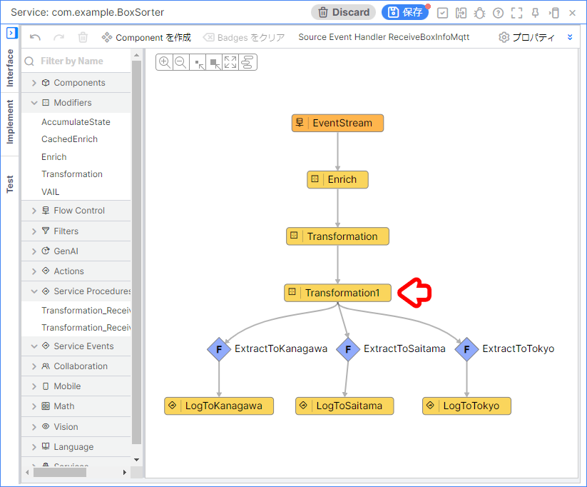

1. `Transformation1` タスクをクリックし、 `タスク名` の設定を行います。

   |項目|設定値|
   |-|-|
   |Name|TransformForMqtt|

1. `Configuration` の `クリックして編集` を開きます。  
   `transformation (Union)` の `<null>` をクリックして、以下の内容を入力し、 `OK` をクリックします。

   |Outbound Property|Transformation Expression|
   |-|-|
   |message|event|

   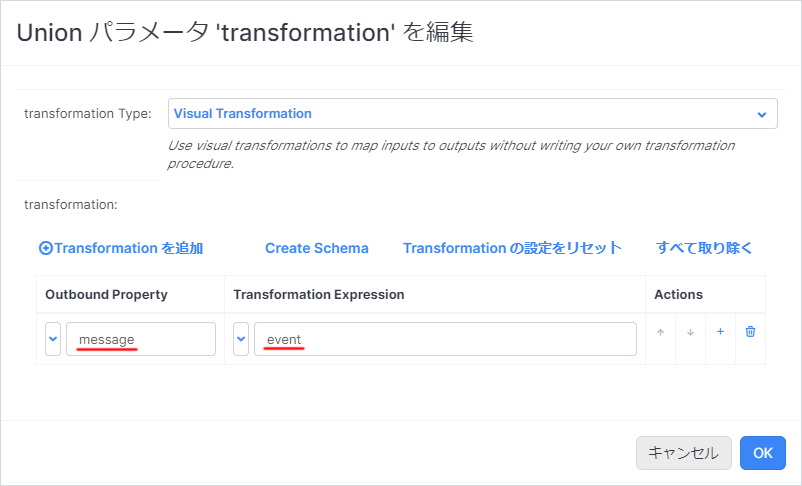

1. **Service** を保存し、 `タスク Events を表示` から、イベントのフォーマットが変換されていることを確認します。

### 4-6. 【Filter】仕分け条件の修正

**Transformation Activity** を利用して、イベントのデータフォーマットを変更したため、後続タスクの **Filter Activity** の条件式を修正する必要があります。

1. 各 `Filter Activity` を選択し、 `Configuration` の `クリックして編集` を開きます。  
   `condition (Union)` の `条件式` をクリックして、以下の内容を入力し、 `OK` をクリックします。

   |物流センター|設定項目|設定値|
   |-|-|-|
   |東京物流センター|condition|event.message.center_id == 1|
   |神奈川物流センター|condition|event.message.center_id == 2|
   |埼玉物流センター|condition|event.message.center_id == 3|

1. **Service** を保存し、アプリケーションが正しく動作することを確認します。

### 4-7. 【LogStream】デバッグ用のログの削除

今回は **LogStream Activity** に代わり、 **PublishToSource Activity** を利用します。  
既存の **LogStream Activity** は利用しないため、削除します。  

1. 各 `LogStream` タスクを選択し、 `Delete` キーを押下し、全ての `LogStream` タスクを削除します。

   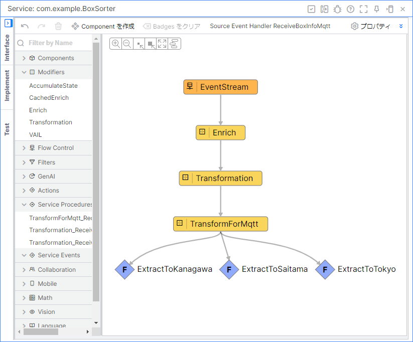

### 4-8. 【Source】送信用の MQTT Source の作成

仕分け結果を外部の MQTT ブローカーに送信するために送信用の MQTT Source を作成します。  

受信用の MQTTブローカーには `public.vantiq.com` を使用しましたが、送信用の MQTTブローカーはご自身で事前に準備いただいたものを使用します。  

このアプリケーションでは、 物流センターごとに異なる Topic にメッセージをパブリッシュします。  

> **補足**  
> 物流センターごとに MQTTブローカーを用意するのは現実的ではありません。  
> そのため、全ての物流センターで同一の MQTTブローカーにメッセージをパブリッシュします。  
> 一方、MQTTブローカー内のメッセージは MQTT の Topic ごとに別れて管理されています。  
> 従って、パブリッシュする際の Topic を物流センターごとに変えることで、物流センターごとに仕分け指示データを別けることができるようになります。  

1. 以下の内容でMQTT Sourceを作成します。

   |項目|設定値|備考|
   |-|-|-|
   |Source Name|SortingResultMqtt|-|
   |Package|com.example|-|
   |Source Type|MQTT|-|
   |Server URI|<ご自身のブローカー>|プロトコルとポートが必要<br/>**例：**<br/>非SSL：`mqtt://your-broker.com:1883`<br/>SSL：`mqtts://your-broker.com:8883`|

   > **補足**  
   > 送信のみに使用しますので Topic の設定は必要ありません。  
   > Topic は送信時に指定します。

### 4-9. 【PublishToSource】MQTT ブローカーへのパブリッシュ

仕分け結果を外部の MQTT ブローカーに送信するために **PublishToSource Activity** を利用します。  

1. Service ペイン左側の `Actions` の中から `PublishToSource` を選択し、各 `Filter Activity` の上にドロップします。

1. 各 **PublishToSource Activity** の `タスク名` の設定と `Configuration` の `クリックして編集` から下記の設定を行い、アプリケーションを保存します。  

   1. 東京物流センター

      |項目|設定値|
      |-|-|
      |Name|PublishToTokyo|
      |source (Enumerated)|com.example.SortingResultMqtt|
      |sourceConfig (VAIL)|{"topic": "/center/tokyo/**yourname**"}|

   1. 神奈川物流センター

      |項目|設定値|
      |-|-|
      |Name|PublishToKanagawa|
      |source (Enumerated)|com.example.SortingResultMqtt|
      |sourceConfig (VAIL)|{"topic": "/center/kanagawa/**yourname**"}|

   1. 埼玉物流センター

      |項目|設定値|
      |-|-|
      |Name|PublishToSaitama|
      |source (Enumerated)|com.example.SortingResultMqtt|
      |sourceConfig (VAIL)|{"topic": "/center/saitama/**yourname**"}|

   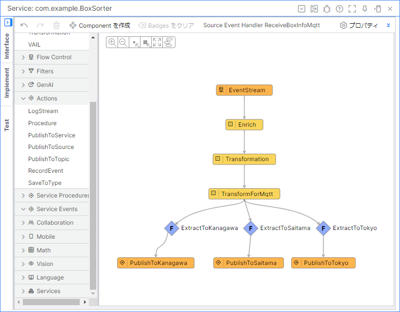

## 5. 仕分け結果の確認

送信用の MQTT ブローカーからデータをサブスクライブし、仕分け結果を確認します。  
MQTT クライアントで送信先の Topic をサブスクライブしておき、正しく仕分けされるか確認します。  

本ワークショップでは、 Google Colaboratory を利用して、サブスクライブを行います。  

> **補足**  
> MQTTクライアントは Google Colaboratory の Python スクリプト以外でも大丈夫です。  
> 例：
> - :globe_with_meridians: [MQTTX](https://mqttx.app/)
> - :globe_with_meridians: [Try MQTT Browser Client](https://www.hivemq.com/demos/websocket-client/) （HiveMQ が提供する Web アプリ）

### 5-1. Google Colaboratory の設定

1. 下記のリンクから **サブスクライブアプリ** のページを開きます。

   - [BoxSorterDataSubscriber（MQTT）](/vantiq-google-colab/code/box-sorter_data-subscriber_mqtt.ipynb)

      > **注意**  
      > Google Colaboratory を利用する際は Google アカウントへのログインが必要になります。

1. Github のページ内に表示されている、下記の `Open in Colab` ボタンをクリックして、 Google Colaboratory を開きます。

   

1. `# MQTTブローカー設定` に以下の内容を入力します。

   |項目|設定値|備考|
   |-|-|-|
   |broker|<ご自身のブローカー>|**例：**`broker.hivemq.com`|
   |port|<ご自身のブローカーのポート番号>|**例：**<br/>非SSL：`1883`<br/>SSL：`8883`|
   |topic|<送信先として設定した Topic 名>|**例：**`/center/tokyo/yourname`|
   |client_id||※変更不要です。|
   |username||※変更不要です。|
   |password||※変更不要です。|

   > **補足**  
   > 本スクリプトでは、1つの Topic しかサブスクライブできません。  
   > そのため、物流センターごとに Topic 名を書き換えてサブスクライブする必要があります。

1. 上から順に1つずつ `再生ボタン` を押していきます。  
   実行が終わるのを待ってから、次の `再生ボタン` を押してください。  

   1. `# ライブラリのインストール`（※初回のみ）
   1. `# ライブラリのインポート`（※初回のみ）
   1. `# MQTTブローカー設定`
   1. `# MQTT Subscriber 本体`

   <br/>

   > **サブスクライブする Topic を変更する場合**  
   > 1. `# MQTT Subscriber 本体` の `停止ボタン` を押して、スクリプトを停止させます。
   > 1. `# MQTTブローカー設定` の `Topic` 変数を書き換えます。
   > 1. `# MQTTブローカー設定` の `再生ボタン` を押して変数を反映させます。
   > 1. `# MQTT Subscriber 本体` の `再生ボタン` を押してサブスクライブを開始します。

### 5-2. サブスクライブしたメッセージの確認

1. 各物流センターのTopicに正しく仕分け指示が届いていることを確認します。

   #### 東京物流センター

   

   #### 神奈川物流センター

   

   #### 埼玉物流センター

   

## Project のエクスポート

作成したアプリケーションを Project ごとエクスポートします。  

詳細は下記を参照してください。  
[Project の管理について - Project のエクスポート](/vantiq-introduction/apps-development/vantiq-basic/project/readme.md#project-のエクスポート)

## ワークショップの振り返り

1. **MQTT**
   1. MQTT プロトコルについて学習しました。
1. **Source** 
   1. Source を用いることで、様々なプロトコルでデータの送受信ができることを学習しました。
1. **App**
   1. **Transformation Activity** を用いて、データフォーマットを変換する方法を学習しました。
   1. **PublishToSource Activity** を用いて、外部にデータを送信する方法を学習しました。

## 参考情報

### プロジェクトファイル

- [ボックスソーター（MQTT）の実装サンプル（Vantiq 1.40）](./../data/box_sorter_mqtt_1.40.zip)

以上
