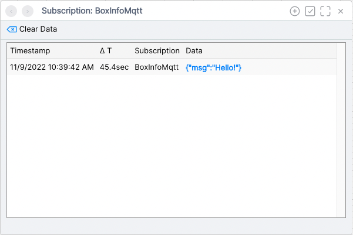

# ボックスソーター（中級編・MQTTX）

## 目次

- [ボックスソーター（中級編・MQTTX）](#ボックスソーター中級編mqttx)
  - [目次](#目次)
  - [1. Namespace の作成と Project のインポート](#1-namespace-の作成と-project-のインポート)
    - [1-1. Namespace の作成](#1-1-namespace-の作成)
    - [1-2. Project のインポート](#1-2-project-のインポート)
  - [2. 入力用 MQTTブローカーの疎通確認](#2-入力用-mqttブローカーの疎通確認)
  - [3. MQTTX からパブリッシュしたメッセージを Source で受け取る](#3-mqttx-からパブリッシュしたメッセージを-source-で受け取る)
  - [4. Source でサブスクライブした内容をアプリケーションで受け取る](#4-source-でサブスクライブした内容をアプリケーションで受け取る)
  - [5. 送信結果が正しく仕分けされているか確認する](#5-送信結果が正しく仕分けされているか確認する)

## 1. Namespace の作成と Project のインポート

### 1-1. Namespace の作成

アプリケーションを実装する前に新しく Namespace を作成し、作成した Namespace に切り替えます。  

詳細は下記をご確認ください。  
[Vantiq の Namespace と Project について](/vantiq-introduction/apps-development/vantiq-basic/namespace/readme.md)

### 1-2. Project のインポート

Namespace の切り替えが出来たら、 Project のインポートを行います。  
**ボックスソーター（初級編・MQTT）** の Project をインポートしてください。  

詳細は下記を参照してください。  
[Project の管理について - Project のインポート](/vantiq-introduction/apps-development/vantiq-basic/project/project.md#project-のインポート)

## 2. 入力用 MQTTブローカーの疎通確認

入力には以下の MQTTブローカーを使用します。

|項目|設定値|備考|
|-|-|-|
|Server URI|mqtt://public.vantiq.com:1883|-|
|Topic|/workshop/jp/yourname/boxinfo|`yourname` の箇所に任意の値を入力する ※英数字のみ|
>この MQTTブローカーはワークショップ用のパブリックなブローカーです。認証は不要です。  
>上記以外の MQTTブローカーを利用しても問題ありません。

1. MQTTX から上記のワークショップ用ブローカーに接続し、以下の JSON メッセージを送信できることを確認してください

   ```json
   {
       "msg": "Hello!"
   }
   ```

   

## 3. MQTTX からパブリッシュしたメッセージを Source で受け取る

MQTTX からパブリッシュしたメッセージを Vantiq の Source でサブスクライブできるか確認します。

1. MQTT Source の確認
   1. `BoxInfoMqtt` Source のペインを開く
   1. 以下の内容が設定されているか確認をする

      |設定順|項目|設定値|設定箇所|
      |-|-|-|-|
      |1|Source Name|BoxInfoMqtt|-|
      |2|Source Type|MQTT|-|
      |3|Server URI|mqtt://public.vantiq.com:1883|`Server URI` タブ|
      |4|Topic|/workshop/jp/yourname/boxinfo <br> ※`yourname` の箇所には疎通確認時に設定した値を使用する|`Topic` タブ|

   1. メッセージをサブスクライブできることを確認する
      1. `BoxInfoMqtt` Source のペインの `データの受信テスト`(Test Data Receipt) をクリックする
      1. MQTTX から疎通確認時と同じようにメッセージを送信する
      1. `Subscription:BoxInfoMqtt` に MQTTX から送信した内容が表示されることを確認する

         

## 4. Source でサブスクライブした内容をアプリケーションで受け取る

MQTTX からパブリッシュしたメッセージを App の `EventStream` でも受け取れているか確認します。

1. `BoxSorter` App のペインを開く
1. `ReceiveBoxInfo` タスクをクリックし、 `タスク Events を表示` をクリックする
1. MQTTX から疎通確認時と同じようにメッセージを送信する
1. `Subscription:BoxSorter_ReceiveBoxInfo` に MQTTX から送信した内容が表示されることを確認する

## 5. 送信結果が正しく仕分けされているか確認する

MQTTX で送信先の Topic をサブスクライブしておき、正しく仕分けされるか確認します。

1. MQTTX で仕分け指示の送信先の MQTTブローカーに接続し、  
   `/center/tokyo` , `/center/kanagawwa` , `/center/saitama` をサブスクライブする

   

1. 前の手順の接続は維持したまま、別途入力用の MQTTブローカー `public.vantiq.com` と接続し以下のメッセージを送信する

   **東京物流センター用**

   ```json
   {
       "code": "14961234567890",
       "name": "お茶 24本"
   }
   ```

   **神奈川物流センター用**

   ```json
   {
       "code": "14961234567892",
       "name": "化粧水 36本"
   }
   ```

   **埼玉物流センター用**

   ```json
   {
       "code": "14961234567893",
       "name": "ワイン 12本"
   }
   ```

1. 各物流センターの Topic に正しく仕分け指示が届いていることを確認する

   **例: /center/tokyo Topic に お茶 24本 の仕分け指示が届いている**

   

以上
