# LLM（AccumulateState Activity）

## 実装の流れ

下記の流れで実装していきます。

1. 【準備】Namespace の作成と Project のインポート
1. 【Secret】各種 LLM の API Key の設定
1. 【LLM】LLM の設定
1. 【Type】スキーマの修正
1. 【Procedure】Procedure の修正
1. 【App Builder】LLM アプリケーションの改修
1. 【動作確認】Log メッセージの確認

> リソース名やタスク名は任意のものに変更しても構いません。

## 目次

- [LLM（AccumulateState Activity）](#llmaccumulatestate-activity)
  - [実装の流れ](#実装の流れ)
  - [目次](#目次)
  - [1. Namespace の作成と Project のインポート](#1-namespace-の作成と-project-のインポート)
    - [1-1. Namespace の作成](#1-1-namespace-の作成)
    - [1-2. Project のインポート](#1-2-project-のインポート)
  - [2. Secret を用いた API Key の管理](#2-secret-を用いた-api-key-の管理)
    - [2-1. Secret の作成](#2-1-secret-の作成)
  - [3. LLM の設定](#3-llm-の設定)
    - [3-1. LLM ペインの表示](#3-1-llm-ペインの表示)
    - [3-2. API Key Secret の設定](#3-2-api-key-secret-の設定)
  - [4. 既存のアプリケーションの動作確認](#4-既存のアプリケーションの動作確認)
  - [5. スキーマの修正](#5-スキーマの修正)
    - [5-1. LlmSchema ペインの表示](#5-1-llmschema-ペインの表示)
    - [4-2. Property の追加](#4-2-property-の追加)
  - [6. Procedure の修正](#6-procedure-の修正)
    - [6-1. Procedure ペインの表示](#6-1-procedure-ペインの表示)
    - [6-2. Procedure の修正](#6-2-procedure-の修正)
  - [6. App Builder を用いた App の改修](#6-app-builder-を用いた-app-の改修)
    - [6-1. 【App Builder】App ペインの表示](#6-1-app-builderapp-ペインの表示)
    - [6-2. 【SuplitByGroup】](#6-2-suplitbygroup)
    - [6-3. 【AccumulateState】イベントの状態の保持](#6-3-accumulatestateイベントの状態の保持)
    - [6-4. 【Procedure】実引数の追加](#6-4-procedure実引数の追加)
  - [7. LLM との会話](#7-llm-との会話)
    - [7-1. Log メッセージ画面の表示](#7-1-log-メッセージ画面の表示)
    - [7-2. /Inbound Topic ペインの表示](#7-2-inbound-topic-ペインの表示)
    - [7-3. メッセージの送信とログの確認](#7-3-メッセージの送信とログの確認)
  - [Project のエクスポート](#project-のエクスポート)
  - [ワークショップの振り返り](#ワークショップの振り返り)
  - [参考情報](#参考情報)
    - [プロジェクトファイル](#プロジェクトファイル)

## 1. Namespace の作成と Project のインポート

### 1-1. Namespace の作成

アプリケーションを実装する前に新しく Namespace を作成し、作成した Namespace に切り替えます。  

詳細は下記をご確認ください。  
[Vantiq の Namespace と Project について](/vantiq-introduction/apps-development/vantiq-basic/namespace/namespace.md)

### 1-2. Project のインポート

Namespace の切り替えが出来たら、 Project のインポートを行います。  
**LLM（SubmitPrompt Activity）** の Project をインポートしてください。  

詳細は下記を参照してください。  
[Project の管理について - Project のインポート](/vantiq-introduction/apps-development/vantiq-basic/project/project.md#project-のインポート)

## 2. Secret を用いた API Key の管理

Secret はネームスペースごとに管理されているため、改めて Secret を作成します。  

### 2-1. Secret の作成

1. メニューバーの `管理` -> `Advanced` -> `Secrets` -> `+ 新規` をクリックし Secret の新規作成画面を開きます。

   

1. 以下の内容を設定し、保存します。

   |項目|設定値|
   |-|-|
   |Name|LlmApyKey|
   |Secret|※各種 LLM サービスで発行した API Key|

   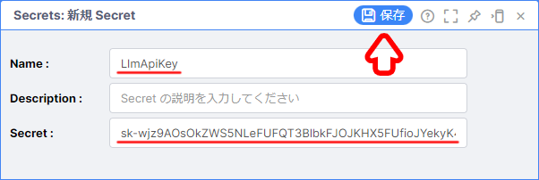

## 3. LLM の設定

LLM の設定を行います。  
Secret の設定をし直す必要があります。  

### 3-1. LLM ペインの表示

1. 画面左側の **Project Contents** から `LLM` ペインを開きます。

   

### 3-2. API Key Secret の設定

1. `LLM` をクリックし、編集画面を開きます。

   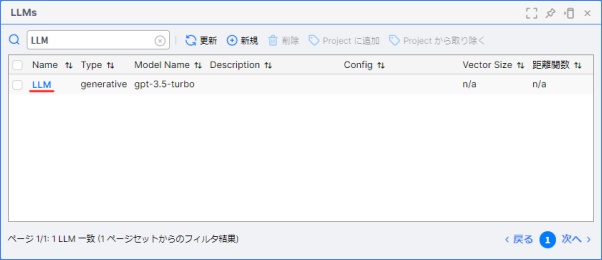

1. 以下の内容を設定し、 `OK` をクリックします。

   |項目|設定値|
   |-|-|
   |API Key Secret|LlmApiKey|

   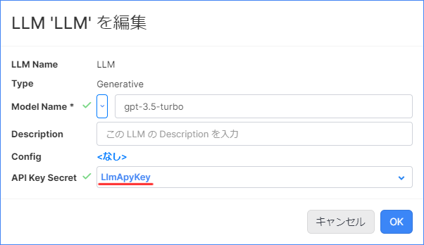

## 4. 既存のアプリケーションの動作確認

`/Inbound` Topic からメッセージを送信し、アプリケーションが正しく動作するか確認します。  

詳細は下記を参照してください。  
[LLM（SubmitPrompt VAIL） - 7. LLM との会話](/vantiq-introduction/apps-development/llm/submitprompt-vail/instruction.md#7-llm-との会話)

## 5. スキーマの修正

スキーマを修正し、会話を特定するための `talk_id` を追加します。

### 5-1. LlmSchema ペインの表示

1. 画面左側の **Project Contents** から `LlmSchema` ペインを開きます。

   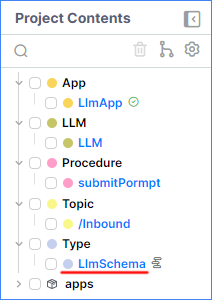

### 4-2. Property の追加

1. `Properties` タブを開き、 `+ Property を追加` をクリックします。

   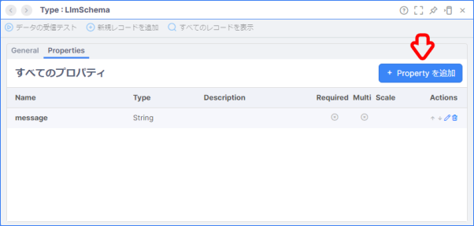

1. 以下の内容を設定し、 `OK` をクリックして、 Type を保存します。

   |項目|設定値|
   |-|-|
   |Name|talk_id|
   |type|String|

   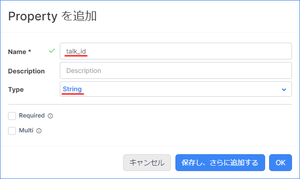

## 6. Procedure の修正

現在のプロシージャでは、会話の継続ができません。  
引数に `conversationId` を渡すことで、会話の継続が可能になります。  

プロシージャを書き換えて、会話の継続ができるように変更します。  

### 6-1. Procedure ペインの表示

1. 画面左側の **Project Contents** から `submitPormpt` ペインを開きます。

   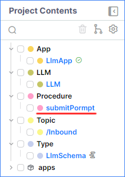

### 6-2. Procedure の修正

1. 下記の内容を入力し、保存します。

   ```JavaScript
   PROCEDURE submitPormpt(prompt, conversationId)

   var response = io.vantiq.ai.LLM.submitPrompt("LLM", prompt, conversationId)

   return response
   ```

   


## 6. App Builder を用いた App の改修

この手順からアプリケーションの改修を開始します。  

今回は **AccumulateState Activity** の追加実装を行っていきます。  
**AccumulateState Activity** を用いることで、イベントの状態を State に保持し、会話を継続できるようにします。  

### 6-1. 【App Builder】App ペインの表示

#### App ペインの表示

1. 画面左側の **Project Contents** から `LlmApp` ペインを開きます。

   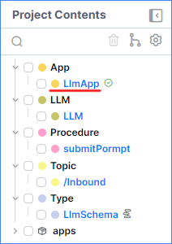

### 6-2. 【SuplitByGroup】

後続のタスクで利用する **AccumulateState Activity** を用いるために、 **SuplitByGroup Activity** を利用して、 `talk_id` ごとにイベントをグルーピングします。  

#### SuplitByGroup の実装

1. App ペイン左側の `Flow Control` の中から `SplitByGroup` を選択し、 `LlmInbound` タスクと `Procedure` タスクの間の **矢印** の上にドロップします。  

   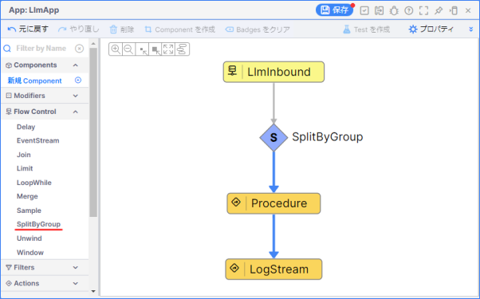

1. `SplitByGroup` タスクをクリックし、 `Configuration` の `クリックして編集` から以下の内容を設定して、アプリケーションを保存します。

   |Required Parameter|Value|
   |-|-|
   |groupBy (VAIL Expression)|event.talk_id|

   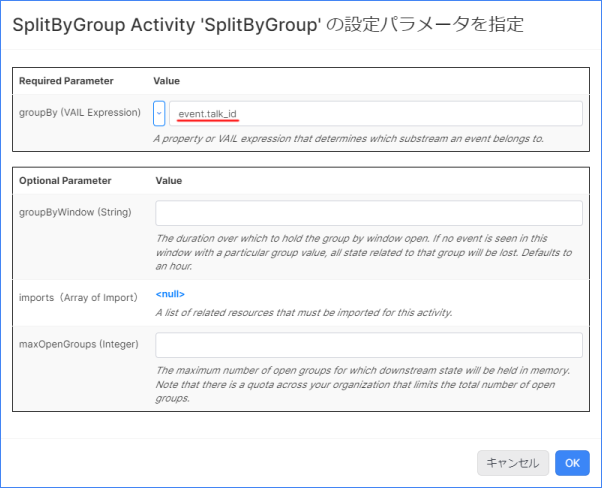

### 6-3. 【AccumulateState】イベントの状態の保持

**AccumulateState Activity** を用いて、イベントの状態を State に保持します。

#### AccumulateState の実装

1. App ペイン左側の `Modifiers` の中から `AccumulateState` を選択し、 `SplitByGroup` タスクと `Procedure` タスクの間の **矢印** の上にドロップします。  

   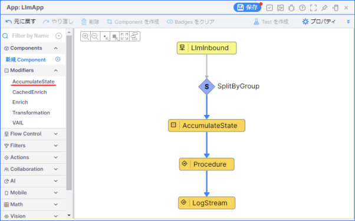

   > **補足**  
   > `Downstream イベント` は `event` を選択します。  
   >
   > 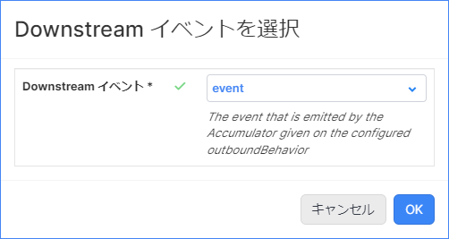

1. `AccumulateState` タスクをクリックし、 `Configuration` の `クリックして編集` から以下の内容を設定します。

   |Optional Parameter|Value|
   |-|-|
   |outboundBehavior (Enumerated)|Attach state value to outboundProperty|
   |outboundProperty (String)|convId|

   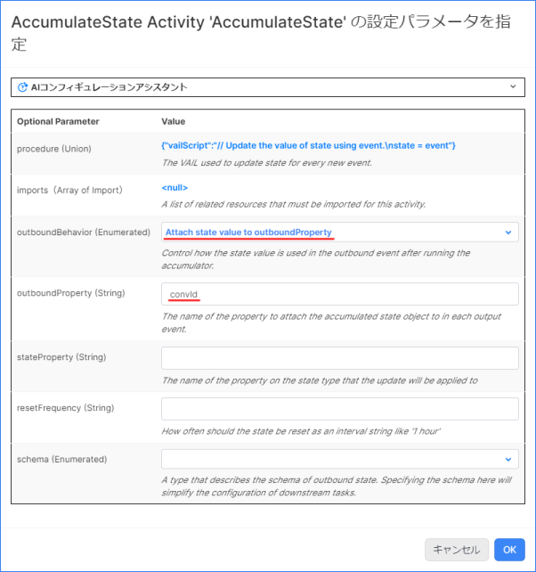

1. `procedure (Union)` の `{"vailScript":"// Update the value of state using event.\nstate = event"}` をクリックします。

   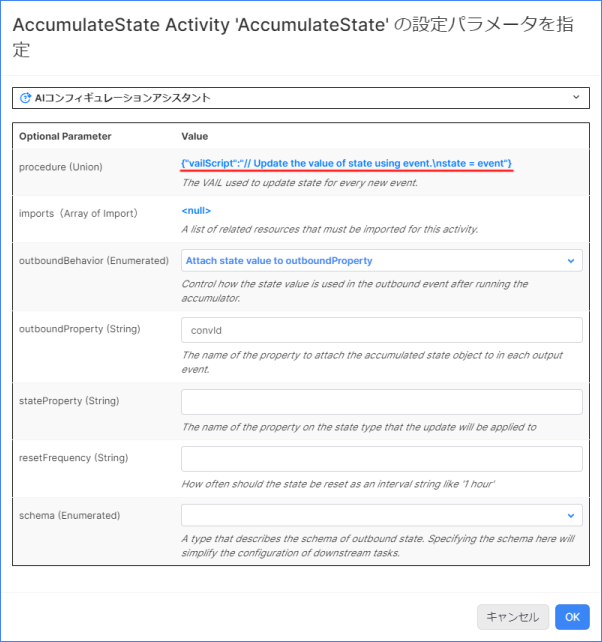

1. 以下の内容を設定して、アプリケーションを保存します。

   |設定項目|設定値|
   |-|-|
   |procedure Type|VAIL Block|
   |procedure|※下記の VAIL コード|

   ```JavaScript
   // Update the value of state using event.
   if(!state){
       state = io.vantiq.ai.ConversationMemory.startConversation()
   }
   ```

   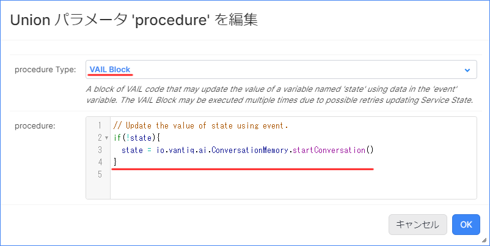

### 6-4. 【Procedure】実引数の追加

Procedure の引数の設定を追加します。  

#### Procedure の修正

1. `Procedure` タスクをクリックし、 `Configuration` の `クリックして編集` を開き、 `parameters (Object)` の `{"prompt":"event.message"}` をクリックします。

   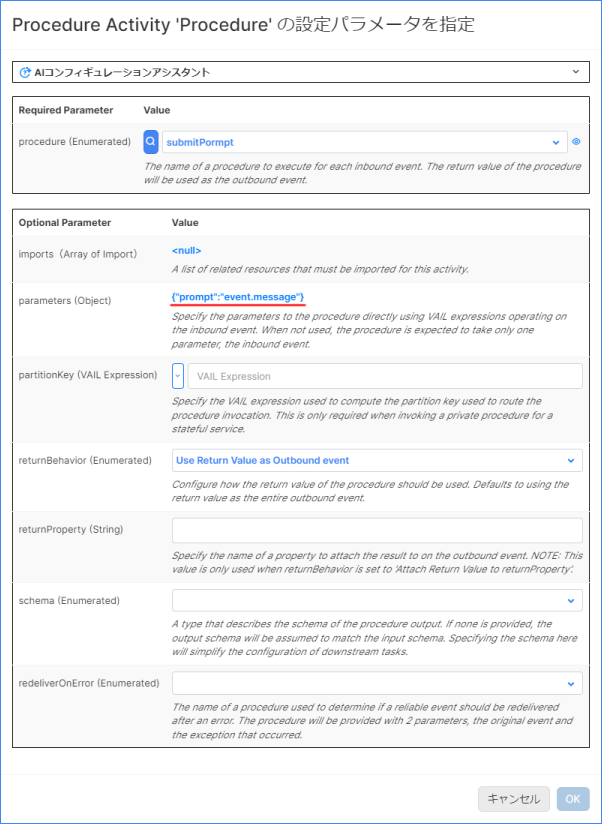

1. 以下の内容を設定して、アプリケーションを保存します。

   |Parameter|VAIL Expression|
   |-|-|
   |prompt|event.message|
   |conversationId|event.convId|

   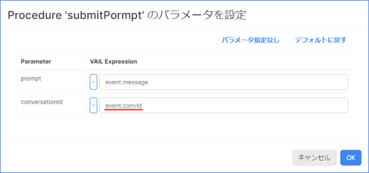

## 7. LLM との会話

Topic からメッセージを送信し、 LLM との会話を行います。  
今回は会話が継続されていることを確認する必要があるため、しりとりを行ってみます。

### 7-1. Log メッセージ画面の表示

1. 画面右下の `Debugging` をクリックします。

1. 右側の `Errors` をクリックし、 `Log メッセージ` にチェックを入れます。

### 7-2. /Inbound Topic ペインの表示

1. 画面左側の `Project Contents` から `/Inbound` Topic を開きます。

   

### 7-3. メッセージの送信とログの確認

1. `/Inbound` Topic ペインから任意のメッセージと任意の会話IDを入力し、 `Publish` をクリックします。

   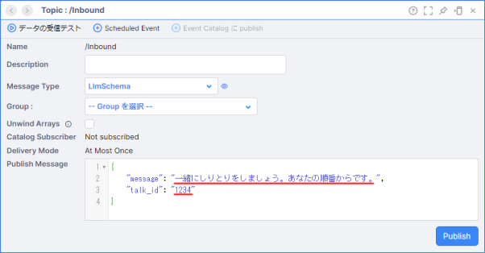

1. ログを確認します。

   

1. 引き続き、会話を継続します。

   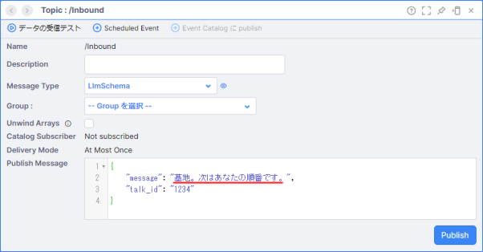

1. 再度、ログを確認します。

   

1. 引き続き、会話を継続します。

   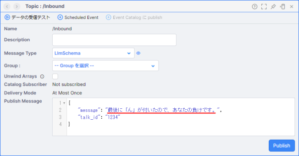

1. 再度、ログを確認します。

   

## Project のエクスポート

作成したアプリケーションを Project ごとエクスポートします。  
Project のエクスポートを行うことで、他の Namespace にインポートしたり、バックアップとして管理することが出来ます。  

詳細は下記を参照してください。  
[Project の管理について - Project のエクスポート](/vantiq-introduction/apps-development/vantiq-basic/project/project.md#project-のエクスポート)

## ワークショップの振り返り

1. **App**
   1. **AccumulateState Activity** を利用し、イベントの状態を State に保持する方法を学習しました。

## 参考情報

### プロジェクトファイル

- [LLM（AccumulateState Activity）の実装サンプル（Vantiq 1.37）](./../data/llm_accumulatestate-activity_1.37.zip)

以上
